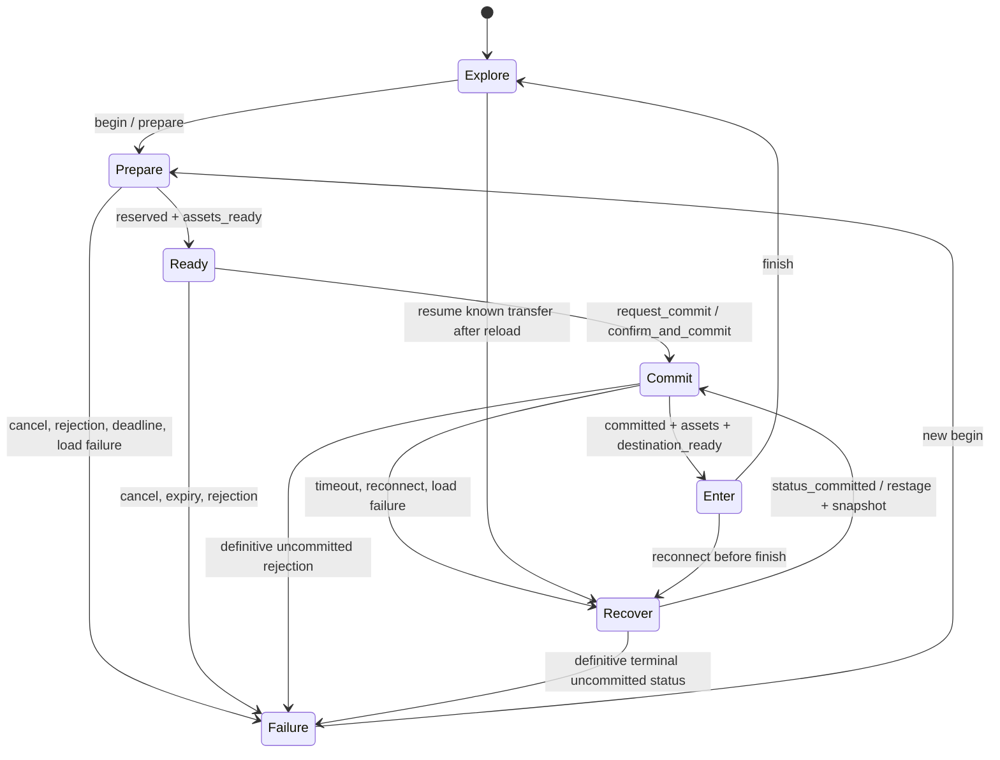

# Dungeon transition design — D0 review candidate

2026-10-01. Binding basis: [region delivery and dungeon transitions](region-loading-and-dungeons.md).
Scope: pure client coordinator, pure server reservation table, draft content contract.
No live instance routing, Babylon scene, transport, content bundle or reward path is
changed. D1 starts only after Claude reviews D0 and confirms root's server work is
finished. Owner approval of gameplay choices remains separate from this core.

## Reuse the existing instance model

`room.rs` owns each `World` on a dedicated thread, with a bounded command inbox,
latest-snapshot watch slot and bounded reliable outputs. `RoomHandle` provides
join/admission, occupancy, close and liveness plumbing. `TowerService` holds a
capped registry of private `TowerInstance`s keyed by session; routing picks that
instance before normal channels. Tower worlds are currently single-session and
use tower tuning, not authored dungeon packages. Reuse the room machinery and
registry lifecycle, but extend admission to an immutable authorised party roster
and a dungeon content/version descriptor. Do not reuse `World::new_tower` as a
party dungeon or create another simulation/socket implementation.

`world.rs` fences inputs/disconnects with connection epochs, and durable saves
with an owner epoch. Those fences are necessary but the current per-world session
map alone cannot enforce a single character across worlds. D1 needs one transfer
owner above routing, covering field, tower and dungeon locations. Existing
`rooms-ui.ts`/`tower-ui.ts` use HTTP assignment followed by reconnect; dungeon
entry can reuse that transport lifecycle once the transaction is acknowledged.

D0's `ReservationTable` is deliberately independent of `RoomHandle`: a single
serialised owner calls it with authenticated character IDs and monotonic server
milliseconds. UUID-shaped transfer/reservation IDs map to `u128`; instance IDs
are server-issued nonzero `u64`. It allocates no room/thread and performs no I/O.
Configured limits bound records (including replay tombstones), registered
characters, party members and reservation TTL. Limits in tests are fixtures,
not approved party-size/gameplay policy.

## Transaction invariants and server states

One transfer describes one immutable roster, party ID/version, source locations
and location versions, destination, content version, reservation ID and expiry.
Members are sorted by character ID. Exact `create` replay returns the original
record; changed data under the same transfer ID is `IdConflict`. A reservation
ID cannot name another transfer. Dungeon instance identities are never reused.
One character can hold at most one pending reservation and exactly one registered
active location. All party members target the same instance.

| Server state / operation | Required behaviour |
|---|---|
| Prepare / `create` | Authenticate and validate entrance range, prerequisites, party snapshot and current character state in the adapter. Reserve all party slots together. Core verifies source location/version, roster uniqueness, capacity and TTL. Old world stays active/recoverable. |
| Load | Client prepares the reserved package. No inventory or reward change. Server instance spawn/collision/nav version must be admitted before accepting confirmations. |
| Prepared → Ready / `confirm` | Each authenticated member confirms the exact content version and consents to commit. Only roster members count; duplicate confirmations are no-ops. Every member must confirm before Ready. |
| Ready → Committed / `commit` | Before expiry, revalidate party version/prerequisites and source ownership in the adapter. Core changes all party locations and increments each location version atomically. Exact replay returns the committed receipt without moving anyone again. |
| Enter | Join the recorded destination with a fresh owner/connection epoch; apply a matching snapshot and authoritative safe spawn. Acknowledge Enter, then resume controls. Remove dormant old membership and perform bounded cleanup. |
| Failure / `release`, `expire` | Prepared/Ready can be released or expired. Clear pending locks without moving characters. Retain terminal records; replay cannot resurrect them. A committed record never expires or rolls back through release. |

Expiry is `now >= expires_at_ms`; calls also expire pending records lazily. TTL
is not extended by retries/confirmations. `expire` returns newly expired transfer
IDs; the D1 resource registry must also sweep record state so implicit expiry
inside create/confirm/commit/release cannot hide cleanup. A member cancelling or
an authorised party-version change releases the entire uncommitted party
reservation. Partial-party commit is excluded in this proposal; owner can select
a different admission policy before D1.

The pure table retains replay receipts and locations in a bounded in-memory
process lifetime. It fails closed when full instead of silently discarding IDs.
It is not crash-safe, a reward ledger or a persistent instance registry. D1 must
durably journal terminal outcomes and compact only after a documented replay
window, keeping persistent uniqueness so an old transfer cannot become a new one.
Committed instance lifetime/idle teardown and roster changes are adapter duties.

## Atomicity across old and new worlds (D1 obligation)

The memory-table commit alone does not move actors safely between owner threads.
The transfer owner must: reserve destination capacity without admitting active
actors; obtain an old-world freeze/checkpoint acknowledgement; fence old input,
combat, inventory writes and saves; persist a compare-and-swap location/version
plus transfer receipt; then admit destination actors under the new epoch. A
durable failure before that CAS unfreezes the old owner and releases capacity.
A failure after it routes reconnect to the committed location. Old actors may
remain dormant until Enter cleanup, but must never act or write concurrently.
Do not hold a world/registry lock over decoding, loading or a network await.

If process/instance loss prevents resuming a committed destination, use a
documented durable recovery transfer to its safe outdoor egress, fence the lost
owner, and preserve encounter/reward receipts. Never silently reroute a dungeon
assignment as though it had never committed. The existing stale-tower fallback
cannot be copied for this case. Return uses the same transaction with a fresh
transfer ID, recorded dungeon source and authoritative field destination; replay
of the earlier entry commit cannot teleport a character back into the dungeon.

Rewards are server-authored encounter outcomes. The durable entitlement key is
`(instance_id, encounter_id, character_id)`, independent of loader generation,
transfer retries or websocket identity. Victory, ledger uniqueness and wallet/
inventory mutation belong in one durable transaction. Entry/Enter acknowledgements
never grant loot. D0 proposes this rule and grants nothing.

## Client states, events and resource ownership

`DungeonTransition` has no framework/Babylon imports or timers. The adapter feeds
events, handles returned effects exactly once and drives `tick` using an injected
finite monotonic clock. Default prepare budget is 30 s and commit/status budget
10 s (tunable engineering defaults, not loading-duration promises). Convert a
server remaining TTL conservatively to the local monotonic deadline; never compare
server wall-clock timestamps directly with `performance.now()`.

Ready is local rendering readiness; it sends no consent until `request_commit`.
Each party client enters Commit when sending its confirmation/request. Once sent,
cancel is disabled: the server may have committed even when the response is lost.
The adapter freezes controls then; timeout/disconnect queries status under the
same transfer ID instead of rolling back or creating a second transfer. An
uncommitted rejection must be authoritative and terminal (Released/Expired or a
request definitively rejected with no future commit possible). A pending/unknown
status or transport error is not that guarantee. A status-query timeout leaves
Recover with an explicit retry effect; no automatic infinite retry loop.

`reserved` pins reservation and content identity; `assets_ready` certifies all
critical preparation, including collision/navigation/spawn identity. `committed`
and `destination_ready` may arrive in either order. Reveal occurs exactly once
after committed receipt, staged resources and destination snapshot are all ready.
Wrong transfer, reservation or content identity cannot authorise entry. After
`finish`, ordinary reconnect/session routing must consult the server's active
location; the coordinator no longer retains the preceding transition.

Every async job captures `{generation, transferId}`. Begin, cancel/failure and
recovery invalidate old generations. `dispose_staging` targets resources/fetches
owned by that generation only; `dispose_stale` targets the late completion's
container, not the new scene. A loader that cannot abort may complete, but its
container must never attach after invalidation. The adapter must check identity
before accepting `assets_ready` and dispose invalid-version imports too. Returned
snapshots are frozen copies; effects carry no renderer resources or callbacks.

Reconnect on the existing coordinator invalidates staging and queries status.
A fresh coordinator after reload uses `resume` with session-resolved transfer,
reservation, dungeon and content identity, queries authoritative status, then
reloads resources and obtains a safe snapshot without issuing another commit.
Local storage is only a hint for lookup, never authority or proof of commitment.

## Protocol proposal only

The brief's `binary-v5.md` is historical; `wire.mjs` currently uses version 6.
No version, tag, opcode, generated types, golden fixture or protocol file is
edited here. Discuss admission of these bounded messages against the active v6
contract during D1; unknown tags must continue to be rejected until supported.
Use the existing authenticated session/exact-Origin/join-ticket path. Destination
and roster are derived server-side; clients cannot select other characters.

| Proposed message | Direction / fields |
|---|---|
| `dungeon_prepare` | C→S: `transfer_id`, `dungeon_id`, expected `party_version`; server derives roster, sources and versions |
| `dungeon_reserved` | S→C per member: `transfer_id`, `reservation_id`, `instance_id`, `content_version`, admitted `manifest_path`, `ttl_ms` |
| `dungeon_ready` | C→S: `transfer_id`, `reservation_id`, `content_version`; authenticated member's consent/readiness, triggers commit once all confirm |
| `dungeon_release` | C→S: transfer and reservation IDs (transfer-only cancellation allowed before response); release is party-scoped and authorised |
| `dungeon_committed` | S→C: IDs, destination instance/zone, `content_version`, new location version; replayable authoritative receipt |
| `dungeon_enter` | C→S: IDs, applied snapshot tick and owner epoch; server checks identity/epoch, not client-reported position |
| `dungeon_status` / `dungeon_status_result` | C→S IDs; S→C terminal/pending state, committed destination/content and current active location/version for reconnect |
| `dungeon_failure` | S→C IDs, bounded error code, authoritative terminal state / uncommitted guarantee; no arbitrary diagnostic strings |
| `dungeon_return` | C→S fresh transfer ID and portal ID; server validates portal/range and runs Prepare again for field package |

Use UUID-shaped IDs on JSON wire, content IDs ≤64 characters, version tokens
≤128, relative manifest paths ≤256. Preserve 512 B C→S and 4 KiB S→C cold caps:
send individual bounded receipts, not a party roster/manifest/scene inside JSON.
Apply existing cold rate budgets. Binary Welcome/snapshot continue to supply
authoritative state; any necessary dungeon Y/zone extensions require a separate
protocol review. A status response for an old committed receipt must include
current location/version: the adapter must resume the current location after a
later return, not use the old destination from the idempotency receipt.

## Babylon 9.27.1 staging and bounded residency (D1 proposal)

Context7's official [loading documentation](https://doc.babylonjs.com/features/featuresDeepDive/importers/loadingFileTypes)
confirms `LoadAssetContainerAsync` returns an unattached container. Context7 did
not provide version-specific results or sufficient shader details; installed
`@babylonjs/core/package.json` reports 9.27.1, and its local declarations verify
`LoadAssetContainerAsync(source, scene, options)`, `AssetContainer.addAllToScene()`,
`removeAllFromScene()`, `dispose()`, `Material.forceCompilationAsync(mesh,
{useInstances})` and `Scene.whenReadyAsync(checkRenderTargets?)`.

Load the admitted critical manifest/dependencies into a staging `AssetContainer`
using the pinned modular API and existing glTF loader registration. Keep old
scene resources recoverable. Stop imported animations/audio/actors and attach
no gameplay observers before commit. Validate hashes, decoded resources,
collision/nav/spawn data and version; share pooled material/texture ownership
explicitly. Warm each required visible material/mesh layout and instanced variant
with `forceCompilationAsync`; skinned, instanced, shadow and render-target
variants must be checked under actual destination lighting. Scene readiness
alone cannot certify detached container readiness. If representative warmup
needs attachment, use a hidden staging scene under the same engine with equivalent
lights/shadows and no gameplay/input. D1 must verify that path on the target
renderer; none of these renderer operations is implemented or measured in D0.

Only after Enter conditions pass should the adapter attach/reveal destination
assets, apply spawn and resume input. On exit stop animations, actors, audio,
observers, timers and input handlers, detach the container and release its leases.
Private container assets are disposed on cancellation, stale completion or exit.
For shared pooled textures/materials, the adapter must remove pool-owned resources
from private disposal ownership before `container.dispose()`; release/ref-count
them separately. Never globally unload all resources or dispose a shared material
while another active container references it.

Proposed initial cache limits: at most one staging destination and one recently
used field entry package, with a 30 s idle TTL. The dormant old scene counts in
residency too. Enforce preset CPU/GPU residency budgets separately from compressed
download bytes; the low preset's existing ≤64 MiB GPU texture target covers the
whole visible scene. Unknown cost is not zero: evict cached packages or perform
a cold reload when admission cannot prove the budget fits. Active resources are
pinned; stale/version-mismatched entries and least-recently-used unpinned leases
are evicted first. If recoverable old + critical staging do not fit, keep the old
world and fail preparation with an actionable resource error. These are targets
for device calibration, not proof of memory stability or mobile performance.

## Loading panel copy

Use the HTML/CSS HUD for Thai shaping, focus and touch. The following Thai stages
and English stage descriptions are copied exactly from the region document;
that document does not specify separate English UI labels.

| Thai stage (exact) | English description (exact) |
|---|---|
| `กำลังเชื่อมต่อห้อง` | server reservation. |
| `กำลังโหลดทรัพยากร` | measured transfer progress when total bytes are known. |
| `กำลังเตรียมภาพและฉาก` | decode, texture readiness and shader work; show an indeterminate stage when progress is not measurable. |
| `พร้อมเข้าสู่พื้นที่` | destination state and spawn are ready. |

Suggested English UI translations for review: “Connecting to room”, “Loading
resources”, “Preparing visuals and scene”, “Ready to enter the area”. Never fake
100% before shaders/server complete. Cancel before consent; status/retry after
consent; errors stay visible above tips. Warm loads may use a brief fade; speculative
prefetch gets no blocking modal. D0 creates no panel or localisation entries.

## Required transition trials and D0 evidence boundaries

| Region document trial | D0 coverage | D1+ required evidence |
|---|---|---|
| Warm/cold destination; weak network; shader/texture first use | Injected deadlines and readiness gates only | Native cold/warm and weak-link timings, bytes, decode/texture/shader readiness and visible-frame capture |
| Cancel, rejection, timeout, stale completion, reconnect after commit | Client tests for every case, lost receipt, fresh-coordinator resume, duplicate commit/snapshot and identity mismatch; server expiry/release/replay tests | Actual fetch/loader cancellation, late-container disposal, server rejection and disconnect at each boundary |
| Party shares instance; no duplicate membership/reward | Server atomic roster commit, duplicate confirmation, source lock, ID/content/capacity tests; return replay regression | Authenticated multi-client party race/roster change; durable crash/retry and reward-ledger duplicate tests (no reward code in D0) |
| Spawn/collision/terrain height agree; usable return | Draft room/spawn/portal references and return-location version test | Claude blockout route both ways, capsule clearance, shared nav/collision/height version, authoritative spawn and loss recovery |
| Repeated entry/exit leaves stable memory and no live observers/audio/actors | Bounded core record/character limits and generation effects; fail-closed tombstones | Repeated native entry/exit counts and CPU/GPU measurements after settle/TTL, including stale loads, actors, handlers and audio |
| Crowded combat, visible-character and AOI budgets independently measured | No claim / no live changes | Crowded combat on target devices, networking/AOI qualification separate from empty-map art |

Acceptance: pure tests establish core decisions only. Full transition, visual,
gameplay and device verdicts remain UNVERIFIED; D0 is a review candidate.
