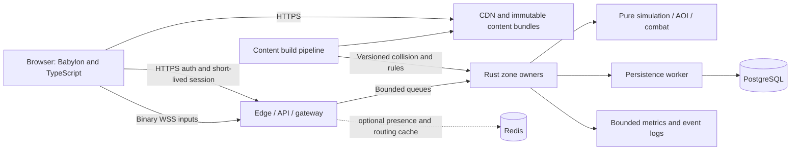

# Historical plans and initial discussion

Consolidated 2026-10-02. Historical source only. Plan v5 is the current roadmap; retain these budgets and closure notes where v5 explicitly references them.

Original bytes are recoverable from the cleanup backup recorded in `docs/document-cleanup.json`. Links and image paths are rebased; source dates and content are retained.

## Contents

- [browser_ragnarok_babylon_rust_10k_plan_v3.md](#plan-v3)
- [browser_ragnarok_babylon_rust_10k_plan_v4.md](#plan-v4)
- [babylon-rust-webgame-chat.md](#initial-discussion)

<a id="plan-v3"></a>
## browser_ragnarok_babylon_rust_10k_plan_v3.md

Original document: `docs/browser_ragnarok_babylon_rust_10k_plan_v3.md`. Preserve its stated status/date; this section is not a new acceptance.

<a id="plan-v3--browser-action-mmorpg--long-term-plan-v3"></a>
### Browser Action MMORPG — Long-term Plan v3

> Historical baseline. Use [plan v4](plans-v3-v4.md#plan-v4) for current status, priorities and P1a/P1b acceptance. The technical budgets and capacity assumptions below remain targets unless superseded; statements about an empty workspace reflect the original planning date.

**Date:** 2026-09-23 · **Status:** proposed implementation baseline · **Delivery:** Harness best-in-code + Jev + verified MCP capabilities

<a id="plan-v3--1-direction--ทศทางหลก"></a>
#### 1. Direction / ทิศทางหลัก

สร้างเกม action RPG ออนไลน์ที่เล่นผ่าน browser ได้จริงก่อน แล้วค่อยขยายเป็น MMORPG โดยรักษาความลึกของระบบอาชีพ สเตตัส ไอเทม และสังคมแบบ Ragnarok ผสมการต่อสู้ third-person ที่อ่านจังหวะได้ และเมืองที่ดูมีชีวิต เป้าหมาย 10,000 CCU คือปลายทางที่ต้องพิสูจน์ด้วย workload จริง ไม่ใช่คำรับประกันจากจำนวนเครื่องหรือภาษา Rust

Start with one compelling 15–20-minute cooperative adventure. Prove it on an actual iPhone, an Android phone, and desktop browsers. Build the persistence and networking foundations alongside gameplay. Expand content only after players can reliably fight, earn an item, disconnect, and return without losing or duplicating it.

Keep Babylon.js + TypeScript, authoritative Rust simulation, PostgreSQL, binary WebSockets, AOI, and CDN delivery. Treat Redis, Havok, generated 3D assets, and extra services as tools with specific jobs and adoption gates. Build an original world by default; the source's named RO towns, monsters, jobs, and systems remain design references, with licensed recreation as a separate product decision.

This is a planning deliverable. It does not claim a built client, successful game benchmarks, approved art, current hosting quotes, or a verified independent Blender MCP connection.

<a id="plan-v3--what-v3-changes"></a>
##### What v3 changes

| v2 idea | v3 refinement | Why it matters |
|---|---|---|
| 12 weeks includes a broad vertical slice and 1,000 bots | 12 weeks is a gated prototype-to-slice attempt; scale qualification has separate exits | Calendar progress cannot establish production readiness |
| AOI/binary in week 9, mobile optimization in week 11 | Protocol, AOI seam, and real-device checks begin in weeks 1–2 | Prevent expensive rewrites and desktop-only content |
| 500–2,000 players per node | A measured capacity envelope by scenario, hardware, zone density, and headroom | Quiet login bots are not fighting players |
| 10 nodes × 1,000 players = 10,000 | Include busiest-zone limits, fleet reserve, gateways, database, and bandwidth | Horizontal capacity is not one giant battle |
| Tick p99 may reach 80 ms at 20 Hz | Work-time p99 target ≤40 ms, deadline misses tracked separately | A 20 Hz interval is only 50 ms |
| Batch all world persistence | Batch transient checkpoints; durably commit acknowledged value transfers | Prevent lost loot, duplicate purchases, and trade exploits |
| AI generation produces game assets | Generate candidates; validate topology, rig, rights, scale, and device cost | A GLB download is not game-ready content |
| Jev/all tools improve everything | Load only relevant capabilities; use Jev for bounded decisions, deterministic checks for acceptance | Reduce context and tool overhead without pretending to prove quality |

<a id="plan-v3--2-assumptions-and-decision-register"></a>
#### 2. Assumptions and decision register

Known: the initial workspace had no game source files. The supplied v2 is a concept and architecture document. Local Harness is available; Jev browser navigation and Higgsfield catalog reads were exercised. Everything below about game performance is a **target** until measured.

| ID | Proposed baseline | Owner / revisit trigger |
|---|---|---|
| A01 | SEA-first single region; regional latency tested from intended audience | Product + operations; change when player geography is known |
| A02 | 2–3 full-time engineering equivalents plus fractional game design/art/QA support for the indicative schedule | Product; reforecast from first two completed slices |
| A03 | Desktop 60 FPS target; qualified mobile 30 FPS baseline, optional 60 FPS tier | Client lead; actual reference-device measurements |
| A04 | 10,000 concurrent **active authenticated players across zones**, excluding login queues and disconnected grace sessions | Backend lead; publish metric definition before benchmarks |
| A05 | First paid hosting experiment constrained by the original 2,000–3,000 THB/month intention; no capacity promise | Operations; obtain itemized regional quotes before purchasing |
| A06 | Original art, names, maps, audio, dialogue, and authored balance data; no bulk rAthena import initially | Product/content; revisit only after provenance review |
| A07 | PvE and cooperative parties first; competitive PvP and guild siege deferred | Design; revisit after combat/network fairness experiments |
| A08 | 20 Hz authoritative simulation; 10–20 Hz replication by priority | Backend; 20/30 Hz comparison only if measured combat quality requires it |
| A09 | Proposed budgets below are reviewable experiment limits, not tested device or host capacities | All leads; change with evidence and an explicit rationale |

The plan can proceed using these defaults. Before implementation investment, settle staffing, reference phone models, original-vs-licensed identity, and which milestone the monthly budget covers. These are decisions for the next phase, not reasons to leave this plan incomplete.

<a id="plan-v3--3-product-pillars-and-scope-boundaries"></a>
#### 3. Product pillars and scope boundaries

<a id="plan-v3--the-loop"></a>
##### The loop

Enter a small hub → choose a field objective → fight and dodge readable attacks → earn EXP and an item → return to equip or customize → unlock a meaningful build choice → repeat with friends. Measure whether players understand the next action and voluntarily repeat the loop before expanding the world.

| Pillar | First playable expression | Later growth |
|---|---|---|
| RPG identity | Base/Job EXP, six familiar stat roles, one melee vocation, two meaningful skill choices | Additional professions, elements, race/size interactions, cards, refine and specialization tiers |
| Action feel | Move, orbit camera, basic combo, dodge, two active skills, one telegraphed enemy | Block/parry, ranged aim, ground skills, support targeting, boss mechanics |
| Cooperative world | Four real players in one field; shared objective and clear loot policy | Parties, guilds, dungeons, events and trading |
| Living town | A few NPC roles, day/night presentation, one scheduled ambient event | More schedules, regional identity, local events and NPC reactions |
| Browser accessibility | Quick entry, readable touch controls, recoverable interruption | More devices, optional quality tiers and accessibility settings |

<a id="plan-v3--release-ladder"></a>
##### Release ladder

1. **P0 technical toy:** one capsule character, flat test map, one enemy, two clients, authoritative movement and damage, reconnect. No polished town.
2. **P1 gameplay prototype:** one small field, one melee vocation, two skills, dodge, one reward loop, four human players. Test enjoyment and touch usability.
3. **P2 vertical slice:** original hub + adjacent field, three enemy archetypes, one mini-boss, 3–5 short quests, inventory/equipment, durable loot, storage, NPC shop, 3–4 active skills plus passive choices, modest day/night and 5–10 schedule-driven NPCs.
4. **P3 closed alpha:** two distinct vocations, one instanced dungeon, parties, basic chat/moderation, controlled access and support tools. Add a small card-like modifier feature only after inventory invariants pass.
5. **P4 closed beta:** several connected zones, 3–4 balanced vocations, guild membership, transactional direct trading; market/refine follow separate economy gates.
6. **P5 public service:** stable operations, content cadence, restore drills, measured acquisition/retention, capacity to serve real demand. Expand toward 10,000 CCU in independent load stages.

Defer full fourth-job breadth, siege warfare, seamless single-instance 10,000-player battles, complex climbing/gliding, vehicles, fully simulated city populations, real-time LLM NPCs, cross-region economy, housing, and extensive crafting. Preserve them as optional expansions with costs, not implicit launch requirements.

<a id="plan-v3--rpg-conversion-contract"></a>
##### RPG conversion contract

Keep Base Level and Job Level distinct. Author STR/AGI/VIT/INT/DEX/LUK and derived HP/SP/ATK/MATK/DEF/resistances in versioned data. Set explicit caps and modifier ordering; avoid multiplying every stat into animation speed without limits. Dodge timing, range, cooldowns, and damage always resolve on the server.

Replace unavoidable invisible hit/miss behavior with clear action feedback. Start with collision-confirmed hits; decide whether HIT/FLEE become bounded accuracy/evasion modifiers rather than importing old formulas unchanged. Criticals, elements and build bonuses must not hide an otherwise readable combat outcome.

Future roles preserve intent: melee frontliner; mobile burst/stealth; aimed ranged/traps; elemental caster/ground AoE; healer/barriers; merchant/crafting utility. Build one role well before making six shallow roles. Higher job tiers reuse tested ability primitives rather than introducing one code path per skill.

<a id="plan-v3--identity-and-provenance"></a>
##### Identity and provenance

Use the emotional roles of a civic capital, arcane tower town, forest settlement, and desert caravan city. Author different geography, landmarks, naming, architecture, characters, audio, and stories. Recreating recognizable protected expression requires an actual rights decision; new geometry alone is not a rights clearance.

rAthena is a reference candidate, not this game's server, protocol, or assumed source of freely reusable content. Its repository carries a GPL license; license and asset provenance must be checked per proposed import. No legal conclusion about a derivative work is asserted here. The default plan avoids copied implementation and proprietary game assets. [rAthena license](https://github.com/rathena/rathena/blob/master/LICENSE)

If authorized data research is later adopted, pin a repository commit, isolate raw input, record licenses, normalize IDs, produce a reviewable diff, and validate formula behavior with golden examples. Never track mutable `master` as a production content dependency. Ragexe/PACKETVER compatibility has no role in the browser protocol; v2's date-specific claims are not carried forward as verified facts.

<a id="plan-v3--product-traceability-from-v2"></a>
##### Product traceability from v2

Original-world direction must preserve the requested play experience, not flatten it into generic fantasy.

| v2 pillar | Original implementation deliverable | Validation phase |
|---|---|---|
| Prontera-like civic identity | A distinctive civic landmark, gathering space, major gate and readable route to the field, with original geography/silhouettes | P2: new testers can identify hub center and field exit without a developer pointing |
| Geffen / Payon / Morroc regional contrast | Distinct arcane, forest and desert palettes, architecture, traversal and local threats, authored independently | P4 onward: one region at a time, after hub/field pipeline succeeds |
| Poring-style expressive creature | Original creature whose silhouette and squash/bounce telegraph communicate a jump attack, flee state and small-group reaction | P1 graybox timing; P2 original model/animation when art capacity permits |
| Armored specter / tactical enemies | Original armored enemy with readable guard, heavy swing and charge/counter behavior | P3 dungeon; no copied character geometry/name |
| MVP encounters | Mini-boss phase change, positioning test, adds or timed danger, and durable reward | P2 candidate; full boss depth in P3 |
| GTA-like living hub | At least one guard patrol and one vendor opening/closing routine with clear interaction availability | P2; schedules remain event-driven and bounded |
| Field discoveries/events | One repeatable ambient field event with a clear start/end and defined reward rule | P2 candidate; may follow the core slice if staffing is constrained |
| Kafra-like utility | Original storage/return-to-hub service, clear cost/availability and persistent storage | P2 |

These are traceable design intentions, not permission to copy protected expression. The game should remain recognizable through its system depth and social rhythm while the actual setting and assets are original.

<a id="plan-v3--4-architecture-and-ownership"></a>
#### 4. Architecture and ownership



Start as a modular repository with a small number of deployables: static client, one Rust server containing distinct gateway/world/persistence modules, PostgreSQL, reverse proxy, and telemetry. Separate world processes once needed for isolation or capacity. Avoid service discovery platforms and orchestration clusters until operations justify them.

| Boundary | Owns | Must not own |
|---|---|---|
| Client presentation | Camera, UI, predicted local motion, interpolated remote entities, audio/VFX | Damage, item creation, currency balances, permission decisions |
| Edge/gateway | Authentication, admission, message limits, zone routing, connection epochs | Per-frame combat or durable economy decisions |
| Zone owner | Authoritative entities, fixed tick, movement, combat, AI, AOI | Blocking SQL or outbound AI calls in simulation |
| Persistence/economy module | Transactions, idempotency, inventory revisions, durable result lookup | Unbounded retries or silent discard of acknowledged value |
| Content pipeline | Signed-off rule bundles, geometry/collision/navmesh, compatibility hashes | Executable unreviewed NPC scripts in production |
| Operations tools | Scoped support actions, feature flags, incident investigation | Unlogged balance edits or unrestricted live SQL |

<a id="plan-v3--proposed-repository-map"></a>
##### Proposed repository map

```text
apps/client/                 Babylon presentation and browser lifecycle
crates/protocol/             bounded wire codec, fixtures, version negotiation
crates/sim/                  pure tick logic and deterministic test fixtures
crates/server/               gateway, zone runtime and persistence integration
crates/content/              validators and server rule loading
crates/bots/                 external Rust scenario driver
packages/protocol-ts/        generated/verified TypeScript codec
content/source/              authored rules, dialogue, zones; no credentials
content/build/               generated manifests; rebuildable
assets/source/               editable art references and Blender masters
assets/packages/             admitted runtime packages and provenance
infra/                      development compose and deployment configuration
tools/                      validation, export and benchmark orchestration
tests/scenarios/             seeds, actions, expected invariants
docs/adr/                   one decision and revisit trigger per ADR
.harness/                   pinned workflow, state and canonical memory
```

This is a proposed tree, not a claim those game modules exist today. Prefer one simple monorepo and shared contracts over premature microservices. Do not write a generic custom ECS framework first: use clear indexed component storage and profile representative hot loops; evaluate an established ECS behind an ADR if it meaningfully reduces code.

<a id="plan-v3--5-client-design-and-mobile-qualification"></a>
#### 5. Client design and mobile qualification

Use full Babylon.js, with versions pinned when implementing the first scaffold. Babylon.js 9 remains the intended major from v2, but the retrieved docs were not version-pinned; verify the exact stable package version and compatible loaders/materials before installing. Avoid a WebGPU-only engine variant when WebGL2 is required.

WebGPU startup needs an asynchronous support check and initialization. Catch adapter/device/init failure and construct a fresh WebGL engine after releasing partial resources. Explicitly verify WebGL2: Babylon's general engine can also fall back to WebGL1, which this plan does not qualify. Support detection alone is not a successful render. [Babylon WebGPU](https://doc.babylonjs.com/setup/support/webGPU), [WebGL2](https://doc.babylonjs.com/setup/support/webGL2)

Reference qualification matrix: Windows Chrome/Edge, macOS Safari, actual iPhone Safari, and midrange Android Chrome. Record device model, OS/browser version, backend, resolution, thermal state and battery mode. Emulation assists UI checks but cannot prove phone GPU memory, thermals, touch latency, or background suspension behavior.

| Metric | Initial proposed gate | Method |
|---|---|---|
| Mobile frame time | p95 ≤33.3 ms during 20-minute field route | Reference phone, 720p-class internal resolution, medium combat |
| Desktop frame time | p95 ≤16.7 ms on chosen midrange reference PC | 1080p internal resolution, same route |
| Initial playable download | ≤12 MB compressed for P0; ≤25 MB for P2 | Cold-cache bytes to first controllable frame |
| First control | ≤15 s on measured 20 Mbps / 80 ms RTT profile for P2 | Separate transfer, parse, decode and shader timings |
| Resident memory | Initial investigation target ≤350 MB total browser game footprint on mobile | Platform tools where available; JS heap is not GPU/process memory |
| Long sessions | No crash/reload or sustained upward memory trend across repeated zone visits | 30-minute phone test and longer desktop soak |
| Controls | Move + camera + skill simultaneously using touch; no accidental page scroll | Real two-thumb test, interruptions, safe areas |

Start with conservative draw/animation budgets, then replace them using captures: about 150 visible draws, 250k visible triangles and 20 fully animated characters on mobile as experiment targets. These are not universal hardware limits. Visibility includes terrain, particles, attachments and shadow passes. Reduce shadow distance, expensive transparency and texture residency before degrading core combat signals.

Touch: left movement stick; right camera drag; large skill and dodge controls; optional target assistance; remapping and left-handed layout later. Keep HUD readable under thumbs and device safe areas. Use DOM-accessible menus for inventory/settings/chat, clear focus, text scaling, non-color-only telegraphs, reduced shake, and reduced flashing. Desktop controls remain WASD/mouse, explicit lock-on, dodge and bounded hotkeys.

User-requested mobile visual sample: [touch HUD v1](../ui/mobile-ui-reference-20261001.md#early-mobile-concept), with left joystick, right action cluster and collapsed chat. This is a concept image; actual pointer handling, physical control sizing and real-device acceptance remain implementation work.

Separate camera from authoritative character facing. Use animation events for presentation; server timelines resolve hits. Predict local movement with input sequence acknowledgments; interpolate remote actors with an initially 100–150 ms adaptive buffer. Clamp extrapolation to a short limit and stop/fade gracefully instead of running remote players through walls.

Havok is optional for visual props or a client controller experiment. The Rust server needs its own tested collision authority; never assume different physics runtimes remain deterministic. Begin with capsule sweeps/static colliders and shared geometry conventions. Add a shared Rust/WASM movement kernel only if measured drift and maintenance cost justify it.

On tab hide/background, stop input generation and expensive rendering, mark input neutral, and resume through snapshot reconciliation. Audio starts after a user gesture. Handle orientation change, context/device loss, Wi-Fi/cellular switching, stale service-worker content and browser termination. Offline UI must distinguish reconnecting from authenticated-session expiry.

<a id="plan-v3--6-simulation-combat-and-bounded-work"></a>
#### 6. Simulation, combat and bounded work

Use a dedicated persistent zone simulation thread, not a CPU-heavy forever-loop on Tokio's async worker pool. Tokio runs socket and persistence I/O, exchanging bounded messages with the zone. Its docs recommend dedicated threads for persistent blocking workloads; bounded mpsc channels provide queue limits. [Tokio spawn_blocking](https://docs.rs/tokio/latest/tokio/task/fn.spawn_blocking.html), [bounded channels](https://docs.rs/tokio/latest/tokio/sync/mpsc/fn.channel.html)

Tick order: admit validated inputs → apply scheduled completions → movement/collision → ability timeline → damage/status/death → authoritative loot intents → AOI → replication → metrics. Use monotonic simulation time, deterministic per-zone RNG streams for reproducible tests, and an explicit stable ordering for conflicting events. Do not promise cross-platform bitwise floating-point replay; define tolerances and invariants.

At 20 Hz the interval is 50 ms. Measure **active simulation work** separately from sleeping, scheduler lateness, queue wait and socket flush time. Initial qualification targets: p50 ≤15 ms, p95 ≤30 ms, p99 ≤40 ms; fewer than 0.1% deadline misses over the steady-state run, with no sustained backlog. Keep at least 30% capacity reserve in the independently limiting resource.

Initial per-tick investigation envelopes: input ≤3 ms, movement/combat ≤10 ms, AI/path completions ≤5 ms, AOI ≤5 ms, replication construction ≤7 ms. They allocate a 30 ms work envelope, not additive percentile guarantees. Profile actual traces before assigning final quotas.

When behind, reduce optional AI/cosmetic work, stop new admissions and cap catch-up work (initially two ticks). A process that stays behind is overloaded; do not hide it by accumulating unbounded debt or accelerating combat to catch up. Alerts include tick lateness, deadline-miss streak, command age, queue fullness and dropped optional updates.

<a id="plan-v3--ability-contract"></a>
##### Ability contract

Every ability declares ID/content version, cooldown, resource cost, range, targeting shape, startup/active/recovery timing, movement restrictions, interrupt rules, maximum affected targets, effect cap, projectile lifetime and VFX priority. Prevalidate finite numbers, units, modifier limits and references at build time. No arbitrary eval or remote script execution in the hot path.

Client submits an ability intent, target/direction and sequence; it never supplies a trusted damage amount. Server checks actor state, resources, timing, target authority and line/range rules. A rejected intent produces an actionable correction. Limit client timestamp influence; begin with server-time resolution and measure whether bounded lag compensation is needed. Any rewind must cap history and prevent attacking through newly changed geometry.

Projectiles use swept collision over the tick interval where needed. Dodge invulnerability windows are authoritative. Hitbox, telegraph and animation timing derive from one content definition. Bosses add phases, adds and positioning mechanics before simply adding health.

<a id="plan-v3--ai-and-living-world"></a>
##### AI and living world

Near active enemies: 5–10 Hz decision updates; combat timeline still resolves at the simulation rate. Distant enemies: 1–2 Hz coarse decisions, then sleep. NPC schedules are time/event driven, with low-rate updates near players. A sleeping NPC can advance its schedule without simulating every step it missed.

Path requests have per-zone and per-entity rate limits, a bounded worker pool and deadlines. Stagger them, cache with navmesh version, and discard results for despawned entities or changed navigation versions. Use simple steering for local avoidance and prevent repeated unreachable-target requests. Cosmetic crowd actors do not receive expensive authoritative combat components.

<a id="plan-v3--7-network-protocol-aoi-and-overload"></a>
#### 7. Network protocol, AOI and overload

Start WSS with a compact, versioned binary protocol. Use HTTPS/JSON for normal account/configuration APIs where it simplifies maintenance. Choose the binary encoding in one short spike: compare fixed-layout codec versus generated schema codec on packet size, malformed-input resistance, evolution, and TS/Rust effort. Do not make cross-language raw memory layout the wire format.

Envelope fields: protocol version, message type, bounded payload length, connection epoch, sequence, tick/baseline identifier where appropriate. Define endianness, coordinate units, integer ranges, optional-field rules and unknown-message behavior. Session-bound actor identity is server derived, not trusted from a client actor ID.

Start with a maximum client command of 4 KiB and explicit message-type limits; tune with evidence. Snapshot chunks may be larger but have per-message, per-tick and per-session byte limits. Reject NaN/infinite coordinates, impossible durations, oversized strings/arrays, bad enum values, malformed lengths, replayed epochs, floods and stale sequences. Maintain TS↔Rust golden byte fixtures and decoder fuzz cases.

| Stream | Delivery policy |
|---|---|
| Movement intent | Coalesce unsent superseded input; preserve sequence/timing semantics |
| State snapshots | Latest useful baseline; periodic full refresh; discard superseded **unsent** snapshots |
| Spawn/despawn/combat | Ordered IDs, explicit lifespan and resync behavior; bounded reliable queue |
| Inventory/economy results | Durable transaction ID and revision; retry/result lookup is idempotent |
| Chat/presence | Rate limited, size capped, independently shed under load |

WebSocket runs on a reliable ordered stream. Once bytes enter the transport they cannot be selectively replaced; delayed large messages can delay later events. The browser WebSocket API has no receive backpressure control. Bound application queues, monitor `bufferedAmount`, reduce server update rate for slow clients, and disconnect/resync persistently slow consumers. A future WebTransport experiment needs measured benefit and a retained WSS path. [MDN WebSocket](https://developer.mozilla.org/en-US/docs/Web/API/WebSocket)

Initial queue budgets: 128 KiB of queued snapshots per client, 64 bounded reliable messages, and 250 ms maximum age for replaceable state. Disconnect or resync on persistent excess; never drop acknowledged economy results without durable retrieval. All numbers are starting limits to test. Size process memory for the maximum of these queues, not just average payload size.

<a id="plan-v3--aoi-correctness-before-speed"></a>
##### AOI correctness before speed

Use a spatial hash/grid with a proposed 32 m cell size. Calculate the cells intersecting each entity's actual relevance radius; a fixed 3×3 neighborhood is wrong when skills or visibility extend farther. Add enter/leave hysteresis. Relevance includes self, current threat, party information, nearby combat and critical telegraphs before ambient characters.

Only serialize visible/relevant entities, at priority-dependent rates. Quantize positions relative to a stable origin with explicit range/precision and boundary handling. Delta snapshots reference an acknowledged baseline; reconnect or missing baseline triggers a full snapshot. Test cell edges, teleports, despawn, dropped application updates and baseline reset.

An AOI cap is not permission to hide a dangerous attacker. If full gameplay relevance exceeds budgets, restrict encounter admission, split instances, or redesign the encounter. Cosmetic distant crowds can use impostors or low-rate presentation; authoritative combat threats must remain represented.

Measure city gatherings separately from spread-out population. Suggested initial encounter caps for experiments: 32 active boss participants and 100 hub occupants; they are design hypotheses, not promises. Test beyond the admitted limit for safe queue/refusal behavior. Larger events require a new client and server qualification.

<a id="plan-v3--8-durable-state-economy-and-failure-recovery"></a>
#### 8. Durable state, economy and failure recovery

PostgreSQL owns accounts, characters, inventory instances, balances, progression checkpoints, quests, economy transactions and audit/outbox records. Redis, when introduced, owns disposable presence/routing/cache information, never sole item ownership or exclusive authoritative character ownership.

Separate transient state from durable value. Position can checkpoint periodically; a completed purchase cannot wait for logout to become durable. Inventory/loot/quest rewards use an asynchronous commit workflow outside the simulation thread.

<a id="plan-v3--transaction-flow"></a>
##### Transaction flow

1. Validate intent against the current actor/ownership version and reserve the affected in-memory action with a bounded deadline.
2. Assign a server-trusted transaction ID and stable idempotency scope; bind client retries to the same authenticated request and payload digest.
3. In one PostgreSQL transaction, check ownership/version and balance, apply item/balance changes, persist the result and an outbox event. Lock rows in a consistent order or use appropriate isolation with bounded whole-transaction retries.
4. Acknowledge success only after the required durable commit. Publish the outbox event at least once; consumers deduplicate by event ID.
5. Apply the durable result to the zone using inventory/character revisions. On ambiguous timeout, query the transaction result; do not create a second purchase or refund blindly.

PostgreSQL's default isolation is Read Committed; it does not automatically serialize multi-step business rules. Choose constraints/locks or Serializable by invariant, and handle serialization failures as whole-transaction retries. [PostgreSQL transaction isolation](https://www.postgresql.org/docs/current/transaction-iso.html)

Required invariants: nonnegative balances, exactly one owner per item instance, no duplicate claim of one reward, no execution of one idempotency key with different payloads, no partial trade, and no stale process writing a newer character revision. Assert these under concurrent requests, disconnection, DB timeout and crash injection.

Enforce these at the database boundary, not through application check-then-write alone. Proposed schema constraints: primary keys on item/transaction/event IDs; a unique `(authenticated_principal, operation_kind, idempotency_key)` with stored payload digest and result; a unique `(eligible_character, reward_origin_key)` for reward claims; a unique `(container_id, slot_index)` for occupied slots; one canonical item-location row keyed uniquely by item ID; foreign keys to valid items, containers and actors; and check constraints for nonnegative bounded balances, valid quantities and legal slot indices. Trade escrow, equipped slots, storage and ground loot are explicit location kinds with a validated ownership model, not independent duplicate item records.

Create the stable `reward_origin_key` before delivering a reward: for example durable encounter-run ID + reward ordinal + eligible character. Do not mint a fresh origin on each reconnect or crash recovery. Refunds and retries reference the original committed transaction. Reject idempotency-key reuse with a different payload digest. Use a canonical lock order by entity/table class and then stable ID, followed consistently by reward, trade and refine paths. Character/inventory updates require the expected revision and current ownership epoch in their database write condition; zero affected rows means reload/reconcile, not overwrite. Test those constraints directly with concurrent independent connections and crash/retry fixtures.

Minimal tables/modules: accounts, characters, character_checkpoints, item_instances, inventory_slots, currency_ledger, transaction_results, quest_progress, content_versions, outbox, admin_audit. Use integer currency units with bounds and an append-only balance-change ledger; distinguish minted rewards, sinks and transfers. Archive/partition event history by measured growth. Keep metric labels free of player/item identifiers.

Position/ordinary progression checkpoint interval begins at 10–30 seconds, with explicit accepted loss behavior. Valuable rewards commit through transactions. RPO 0 for acknowledged economy operations applies only within the chosen durable database failure domain; a single host plus daily backups does not achieve regional-loss RPO 0. If that durability is required, budget synchronous replication and test failover before promising it.

<a id="plan-v3--reconnect-and-duplicate-sessions"></a>
##### Reconnect and duplicate sessions

Use short-lived authenticated sessions, connection epochs, heartbeat, randomized exponential reconnect delay, and full resync when needed. Proposed disconnect grace is 30 seconds, but combat rules determine whether the actor remains attackable. Prevent disconnect-to-escape exploits. The server neutralizes stale input and allows only one authoritative live session per character.

Do not put long-lived credentials in WebSocket URLs or browser local storage by default. Prefer a same-site secure HttpOnly session plus an appropriate WS authorization flow, validate Origin, and enforce CSRF protections for cookie-authenticated mutating APIs. If a short-lived connection ticket is used, redact it and make it single-use with an expiry.

<a id="plan-v3--zone-handoff"></a>
##### Zone handoff

Use loading portals initially. Transfer state: ACTIVE → PREPARING → DURABLY_TRANSFERRED → TARGET_ACTIVATED → SOURCE_RELEASED. Freeze conflicting durable operations, write a transfer record and monotonically increasing owner epoch, then activate the target. The target validates epoch and transfer ID; old owners are fenced from writes. On timeout, inspect the durable record rather than allowing both worlds to resume independently. Restart at the last valid checkpoint/portal if necessary; seamless live migration is deferred.

Test failure before commit, after commit before notification, during target activation and after client reconnect. Check item/HP/location state and exact owner count. Gate multi-zone release on these cases.

<a id="plan-v3--9-asset-and-world-production"></a>
#### 9. Asset and world production

Use the [delivery and asset playbook](../delivery-and-asset-playbook.md) as the operational contract. Higgsfield generates references/candidates; Blender authors and normalizes geometry; the content build produces versioned client and server outputs. No generation service runs in the live game loop.

First kit: one original hero, one melee weapon, three enemy archetypes, 8–12 reusable building pieces, 10–15 props, a terrain/foliage set, one mini-boss arena, essential UI icons and short audio loops. Reuse modular pieces before commissioning a city. The first pipeline trial is a simple prop, then a doorway/wall kit, then a rigged character—each tests a different failure mode.

Initial asset targets: small prop 300–2,000 triangles; building module 1,000–8,000; main character 10,000–20,000 LOD0 with cheaper LODs; ordinary enemy 3,000–8,000. Treat these as art budgets to be profiled, not automatic acceptance. Draw calls/material count, transparency, skinning and textures can matter more than triangles.

Common textures 512–1K, important characters 1–2K. Produce KTX2/Basis variants only after choosing compatible runtime decoders and measuring target devices. Mesh compression reduces transfer size but can add decode cost; compare one compression path at a time. Pin exporters and converter versions. Keep uncompressed masters.

Every package carries source/provenance, input/output hashes, units, bounds, pivot, material/texture list, skeleton/clip contracts, collider/navmesh settings, LODs, licenses/receipts and validation report. Client visual terrain and server collision derive from the same authored source and share a versioned manifest. Reject a client/server geometry mismatch at zone load.

The hub supports third-person sightlines, camera collision, readable exits, NPC interaction space and wider touch-friendly navigation. Field chunks stream ahead of travel and release unused references. Version immutable bundles by hash; a small manifest chooses a compatible release. Do not preload all professions, all music or every town.

<a id="plan-v3--10-validation-and-evidence-gates"></a>
#### 10. Validation and evidence gates

All performance numbers below are **proposed acceptance targets**, not measurements. Publish the workload seed, build commit, release profile, CPU/model/limits, memory, browser/device, content hash, network profile, warmup and run length with results.

| Gate | Required evidence | Release implication |
|---|---|---|
| G0 foundation | Client can render WebGPU and forced WebGL2, WSS codec roundtrip, pinned toolchain, CI smoke, content convention fixture | Begin actual gameplay work |
| G1 authority | Two clients cannot spoof movement/damage; replayed inputs rejected; disconnect/resync works | Expand to four human testers |
| G2 fun + mobile | Four players complete one loop; at least 4/5 new testers finish the basic objective without developer instructions; phone budget captured | Invest in slice art/content |
| G3 persistence | Duplicate/conflicting reward/trade simulations, crash boundaries and restore test preserve invariants | Persistent closed alpha allowed |
| G4 one-zone capacity | Active workload at admitted cap passes tick, queue, memory and client budgets; safe rejection above cap | Publish a measured zone limit |
| G5 fleet/recovery | Two-zone handoff, node kill, reconnect storm, gateway restart, DB slowness and spare capacity tested | Multi-zone alpha/beta |
| G6 operations | Backup restore, canary/rollback, access audits, runbooks, abuse handling and support ownership | Public service decision |
| G7 10k qualification | 10,000 active scenario players across specified zones with fleet reserve, separate hotspot tests, costs and 24-hour soak | Claim only the tested envelope |

<a id="plan-v3--load-test-ladder"></a>
##### Load-test ladder

Build bots that execute the real login/session, protocol, spawn, movement, attack, skills, reward and reconnect paths. Keep load generators on separate hosts and measure their saturation. In-process simulation benchmarks are useful diagnostics; label them separately from network clients and real browsers.

| Scenario | Population/workload | Required duration and emphasis |
|---|---|---|
| Smoke | 2 / 10 / 50 active players | 10 minutes; protocol and authority correctness |
| Early load | 100 active bots + 4 real browsers | 30 minutes; queue bounds, movement/combat and rendering |
| Node qualification | 250 → 500 → 1,000, only advancing after pass | 10-minute warmup + 60-minute steady state; repeat 3 times |
| City hotspot | 100 → 250 → 500 → 1,000 in one area, including over-cap requests | Admission limit, AOI fan-out, bandwidth and client VFX/crowds |
| Boss/AoE | Defined participants, monsters and skill casts/sec | 30 minutes; telegraph visibility, target caps and collision cost |
| Login/reconnect storm | 20% of target population over 30 seconds, then larger controlled steps | Auth/database pressure, jittered retries, admission queue |
| Failure | Kill a zone/gateway; delay or interrupt DB; flush disposable cache | Ownership, recovery time, no duplicated acknowledged value |
| Soak | Qualified mixed workload at expected daily load | 6 hours at alpha; 24 hours before large public capacity claim |
| Mobile impairment | 40/100/200/350 ms RTT, jitter and 0/1/3% loss via network shaping | Correction quality, ordered-stream stalls, reconnection and fairness |

Sample mixed workload: 60% moving/combat, 20% town/social, 15% traversal, 5% menus. Record actual actions/sec, changed relevant entities, active monsters, path requests, skill effects and durable writes. Change the mix when real telemetry shows otherwise; do not compare new results against an incompatible baseline.

CI sequence: formatting/type/build → sim/protocol/content checks → transaction integration → browser smoke on both render paths → bounded bot scenario → report. Longer device tests, soaks and restore drills run at milestone gates. Do not rerun expensive complete suites for prose-only edits.

Failure triage keeps the fixed workload and thresholds. Profile one bottleneck, form one hypothesis, make one reversible change, compare correctness and resource metrics. Stop after two no-progress iterations or three repeated failures and redesign the experiment. Never claim performance improvement from changing the workload or dropping gameplay.

<a id="plan-v3--11-capacity-and-cost-model"></a>
#### 11. Capacity and cost model

Treat CCU, registered users, visible actors and concurrent socket connections as separate metrics. The initial budget is an experiment constraint. It does not prove a VPS with a particular core count, physical CPU allocation, egress allowance or DDoS protection is available at that price.

Use [capacity_model.py](../../tools/capacity_model.py) with [capacity-assumptions.json](../../planning/capacity-assumptions.json). It computes estimates only. All rates are decimal Kbit/s and GB/TB; a month is modeled as 30 days.

```text
peak Mbps = peak CCU × active outbound Kbit/s × overhead factor / 1000
monthly GB = average CCU × Kbit/s × overhead factor × 1000 / 8 × month seconds / 1e9
safe node capacity = floor(measured sustainable active CCU per node × headroom fraction)
world nodes = ceil(peak CCU / safe node capacity) + failure-reserve nodes
```

The safety factor applies only if the benchmark capacity did not already include reserve. Avoid applying the same headroom twice. A fleet formula does not solve a single overloaded zone; routing/admission and partition granularity must fit the measured zone envelope.

At 10,000 active players and 50 Kbit/s outbound each: 500 Mbps payload. A hypothetical 1.2 overhead factor gives 600 Mbps. If average CCU is 35% of peak over 30 days, this is **68,040 GB (68.04 TB) of realtime outbound traffic/month**; at continuous peak it is 194.4 TB. CDN asset downloads, ingress, internal gateway/world traffic, replication and retries are separate. If a measured wire rate already includes overhead, set the factor to 1.

Illustration only: a measured 1,000-player/node ceiling, 70% admission factor, 10,000 peak players and one spare requires `ceil(10000/700)+1 = 16` world nodes. This is arithmetic, not a prediction that a chosen CPU will reach 1,000 or that every zone can move between nodes instantly.

| Cost category | Inputs required before quoting |
|---|---|
| World compute | Actual CPU class, shared/dedicated limits, node cap from scenarios, reserve |
| Gateway/API | Connection and handshake capacity, TLS CPU, ingress/egress, redundancy |
| Database | Primary/replica/storage/IOPS, backups, PITR, restore target |
| Static content | Cold downloads, updates, DAU, CDN/object storage rates and geography |
| Realtime bandwidth | Measured outbound and ingress, duty cycle, included transfer, overage and DDoS policy |
| Operations | Metrics/log retention, alerts, domain/TLS management, support and on-call |
| Production | Artist effort, Higgsfield/3D generation attempts, cleanup time, audio, moderation |

Do not repeat v2's 15,000–40,000 THB for 10k as a reliable forecast. Obtain two suitable regional quotes after a qualified benchmark, include tax/currency assumptions and renewal prices, then calculate low/base/high duty cycles. Compare total costs per engaged player-hour; tiny infrastructure savings do not justify months of custom platform work.

Scale when any limiting signal is sustained: tick deadline misses, command age, outbox backlog, memory pressure, network saturation or occupancy. CPU alone misses a saturated single simulation thread. First shed optional work and stop admission; then add proven capacity. Scale down only after draining and verifying ownership handoff.

<a id="plan-v3--12-security-and-operations-by-milestone"></a>
#### 12. Security and operations by milestone

Server authority is necessary but not sufficient. Enforce object-level permissions for inventory, trade, guild/storage and GM actions. Rate limit connection creation, login, commands, chat and expensive paths independently. Make failures observable and bounded.

Before alpha: encrypted transport, secret isolation, secure sessions, parser limits, patchable dependencies, provenance for generated content, audit IDs, backup/restore procedure and administrator separation. Before public launch: abuse reports/mute/block, moderator roles, retention/deletion procedures, incident escalation and legal/privacy review appropriate to audience and region. No payment or premium economy is included until its product and compliance scope is defined.

Metrics: tick work/lateness by zone, active/admitted sessions, AOI counts, bytes/player/sec, corrections, socket queue age, reconnect success, DB pool/lock latency, durable-transaction errors, outbox age, asset load/parse time and client backend/device cohort. Logs use event/correlation/transaction IDs with redaction and bounded retention. Sample traces; never make player IDs metric labels.

Release by immutable build/content version: local → disposable staging → small invited cohort → larger cohort. Pin schema/content/protocol compatibility. Use additive database migrations, compatibility windows and deliberate removal later. Keep the prior client/content/server release accessible for rollback; irreversible data changes need a forward-repair plan, not an assumed binary rollback.

Initial recovery targets to validate: process recovery ≤5 minutes; single-region database restore ≤60 minutes for the tested dataset; routine transient checkpoint loss ≤30 seconds. State the failure domain and backup age. A regional disaster target is a separate architecture/budget decision. Test restores on a fresh environment and reconcile inventory ledger balances before re-opening gameplay.

Runbooks: login failure, slow zone, queue growth, suspected duplication, database unavailable, corrupt content bundle, hotfix rollback and compromised administrator. Each names detection, admission/safety action, owner, evidence, recovery and player communication. Provide feature flags to disable trade/refine/market independently without shutting down basic combat.

<a id="plan-v3--13-first-12-weeks--gated-sequence"></a>
#### 13. First 12 weeks — gated sequence

The schedule assumes A02 and stable decisions; it is not a launch commitment. A solo developer should prioritize the same sequence and reforecast scope rather than compressing validation. Each week ends with one reviewable playable or evidence artifact.

Plan only 60–70% of available engineering time as new feature work; reserve the remainder for integration, device/setup delays, defects and review. Name the actual client, server/data and art/QA owners before committing the weekly sequence. At the week-4 checkpoint, use completed-ticket throughput and unresolved gates to re-estimate P2. Twelve weeks targets a **P2 candidate**, and may end with a validated P1 if capacity is lower.

Fallback scope keeps authority, mobile qualification, reconnect and durable-reward gates intact: retain graybox/manual low-poly assets; reduce to one enemy and one quest loop; defer mini-boss, ambient field event, additional enemies and decorative town detail. If G3 is unfinished, use disposable playtest characters with an explicit reset policy and do not open persistent alpha. Resume deferred identity/content items from the traceability table after the foundations pass; never label a reduced P1 as a finished P2.

| Week | Main work | Reviewable exit | Dependency / stop rule |
|---|---|---|---|
| 1 | Pin toolchain, protocol sketch, engine fallback, first device test, Harness workflow | One rendered scene on desktop + phone; binary golden fixture; measurements recorded | Stop content investment if fallback/device boot fails |
| 2 | Authoritative motion, two clients, input sequence/epoch, basic AOI seam | Two clients agree on movement; invalid input rejected; 10 active bots | G0; no local-only motion demo counted as multiplayer |
| 3 | Camera, touch movement, dodge/attack timeline, one enemy | First combat loop, telegraph/hit timing trace | G1 authority before elaborate combo/VFX |
| 4 | Reconnect, network impairment, four-human test | P1 playtest notes and correction/jitter capture | If combat is unclear, simplify before more skills |
| 5 | Inventory schema, durable reward, idempotency and crash tests | Same reward cannot be claimed twice; committed result survives restart | Persistence design reviewed before crafting/trade |
| 6 | Equipment/stats/EXP, content validator, one progression choice | Data-driven build choice changes gameplay predictably | G3 subset passes; no bulk RO data import |
| 7 | Higgsfield reference trial, Blender modular kit, export/collision test | One prop and doorway package admitted into actual client/server | Budget and provenance gate before asset batches |
| 8 | Hub + field blockout, 3–5 quests, NPC shop/storage | End-to-end 15–20-minute loop with original placeholder art | Stay within one hub/field |
| 9 | AOI edge cases, priority replication, animation/texture budgets | 100 active bots + four browsers; phone capture | Fix correctness before increasing bot count |
| 10 | Profile workload, controlled 250/500 step if green | Comparable perf report with plateau/failure behavior | 1,000 is optional evidence work, not a forced date target |
| 11 | Mini-boss, limited day/night/NPC schedule, asset streaming | Combat cues readable with low quality setting; repeat zone unload | Drop ambient complexity if phone budget fails |
| 12 | Fresh playtest, restore/reconnect drill, slice review and reforecast | P2 candidate + G0–G3 evidence + measured capacity limit | Proceed to alpha only on evidence; otherwise focused rework |

<a id="plan-v3--14-longer-term-roadmap-and-staffing"></a>
#### 14. Longer-term roadmap and staffing

This is a 12–24+ month planning horizon for a small experienced team, not an industry estimate or guaranteed completion time. Actual content throughput, quality bar, staffing and playtest results determine dates. A sustainable 10k service can take longer; audience growth is separate from technical capacity.

| Window | Product and engineering outcome | Exit gate / investment decision |
|---|---|---|
| Months 0–3 | P0–P2 foundation and narrow slice | Fun, mobile, authority and durable rewards; cancel or redesign if loop fails |
| Months 3–6 | Closed alpha, second vocation, party, one dungeon, support tools | G3/G4, 50–200 invited real players as recruitment permits, 6-hour soak |
| Months 6–9 | Multi-zone portals, ownership transfer, two gateway/world failure drills, content tooling | G5, measured 500–1,000 fleet workload; qualified hotspot cap |
| Months 9–12 | Closed beta, 3–4 vocations, guild basics, direct trade, moderation | Economy concurrency/crash gates; release/restore rehearsal; player return evidence |
| Months 12–18 | Wider beta or launch only if ready; market/refine after economy experiments | G6, controlled 2,000 → 5,000 fleet qualification and cost review |
| Months 18–24+ | Further professions/regions, live events, operational hardening | G7 for 10,000 if demand and budget justify it; independent hotspot envelope |

One person can hold multiple roles, but every gate has a named accountable owner: product/game design, client/graphics, Rust/networking, economy/data, technical art, QA/devices and operations. Reserve engineering time for telemetry, build tools, security and bug fixing; AI assistants do not replace device testing, art direction, playtesting or on-call response.

After alpha, plan six-week content cycles as a starting experiment: design/data prototype → graybox and combat → art integration → internal test → invited cohort → rollout/review. Track rework rate, defect escape, time per accepted asset and player completion. Keep at least one cycle of rollback-compatible content available. Do not promise a content cadence until two cycles complete sustainably.

<a id="plan-v3--15-harness-and-jev-operating-model"></a>
#### 15. Harness and Jev operating model

Harness is the delivery framework, not the game server. The plan uses full scope for architectural/scale reasoning, while individual implementation tasks select the smallest appropriate route. One owner controls shared state; agents receive bounded files and checks. Use fixed primary model/effort per task and fast isolated workers only for justified mechanical tasks.

Jev has two separate roles: live bounded browser navigation, and optional query-specific context selection in the local Harness runtime. The first was tested in this session; the second has a local extractive default and does not imply a live remote decision service. Neither establishes game performance or authorizes changes.

Keep tools conditional: Context7 for current APIs, Jev for observed navigation/relevance, Higgsfield for candidate art, Blender for scene/asset work, deterministic validators for admission, bot harness for networking, profiler for measured bottlenecks. The [playbook](../delivery-and-asset-playbook.md) names the relevant skills and triggers. “All tools” means complete capability coverage, not invoking unrelated services.

Durable files hold brief facts and accepted decisions; detailed plans remain versioned documents. Do not put raw chat, secrets, generated assertions or current provider pricing into canonical memory. Proposed architecture remains proposed until accepted. Resume from the active run and one next action; do not start an unattended long-term development loop from this planning request.

<a id="plan-v3--16-highest-risks-and-next-experiments"></a>
#### 16. Highest risks and next experiments

| Risk | Early signal | Smallest resolving experiment |
|---|---|---|
| Game is technically sound but dull | Players stop after one reward | Five new-user sessions on the minimal loop before larger art production |
| Touch action combat is frustrating | Camera/skill conflicts, unreadable telegraphs | Four-player real-phone test in week 3–4 |
| Different movement models drift | Frequent large corrections near slopes/doors | Shared collision fixture with recorded input and server/client trajectory comparison |
| Crowd fan-out defeats node capacity | AOI/serialization dominates; phone FPS collapses | One hot plaza and boss scenario with safe participant caps |
| Economy duplicates under failures | Retries mint rewards or ownership forks | Crash at every transaction/handoff boundary and assert ledger invariants |
| Generated assets cost more to repair than hand-authored kits | Rig/UV/material rework dominates | Compare time/cost for three accepted assets from each method |
| Low compute quote hides egress cost | Traffic estimate exceeds included quota | 24-hour wire-byte capture extrapolated with measured duty cycle |
| Broad inspiration becomes unbounded scope | More professions/world features than tested loops | Enforce P2 freeze; route new ideas into later backlog |
| Tool integration claims exceed reality | No Blender connector, unsupported import route | Read-only capability handshake and one staged prop export before batching |
| AI delivery workflow becomes overhead | Large context/tool use without better acceptance | Compare task success, elapsed time and reported cost on matched bounded tasks |

<a id="plan-v3--17-first-implementation-task-and-acceptance"></a>
#### 17. First implementation task and acceptance

Next task: **P0 foundation only**—create a Babylon/TypeScript client and Rust server with one capsule, a small collision fixture, two connected clients, input sequence/connection epoch, authoritative movement, forced WebGL2 path and repeatable 10-bot smoke. No polished town, store, generated character or external deployment in that task.

Its handoff must show actual startup instructions, exact dependency versions, a two-client clip or browser evidence, protocol fixtures, invalid-input cases, reference-phone observations, and a measured baseline. If either device boot or authoritative movement fails, fix that before selecting P1.

The planning deliverable is complete when the architecture, scope, milestones, risk experiments, asset pipeline, tool capability limits and capacity arithmetic are inspectable and consistent. Acceptance of this plan authorizes an implementation baseline only to the extent of the user's next instruction; it does not represent benchmark evidence.


---

<a id="plan-v4"></a>
## browser_ragnarok_babylon_rust_10k_plan_v4.md

Original document: `docs/browser_ragnarok_babylon_rust_10k_plan_v4.md`. Preserve its stated status/date; this section is not a new acceptance.

<a id="plan-v4--browser-action-mmorpg--plan-v4"></a>
### Browser Action MMORPG — Plan v4

> Superseded by [plan v5](../browser_ragnarok_babylon_rust_10k_plan_v5.md) on 2026-09-24. Kept for history and the V4-01/V4-02 closure notes; its baseline, queue and next-action lines are out of date.

**วันที่:** 23 กันยายน 2026 · **สถานะ:** revised working plan, not a release certificate  
**เป้าหมาย:** เกม MMORPG โลกต้นฉบับที่รักษาความลึกของระบบแบบ Ragnarok เล่นบน browser/มือถือได้ มีการสำรวจและ co-op ที่สนุก และขยายระบบตามหลักฐานจริง  
**งบเครื่องมือเริ่มต้น:** 0 บาทสำหรับ API generation, asset purchase และบริการ cloud ใหม่

<a id="plan-v4--1-ใชแผนนอยางไร"></a>
#### 1. ใช้แผนนี้อย่างไร

เอกสารนี้เป็นแผนดำเนินงานหลักต่อจาก [v3](plans-v3-v4.md#plan-v3) และแก้สถานะ/ลำดับงานที่ล้าสมัยใน v3; เก็บ v3 เป็นประวัติและแหล่งรายละเอียดทางเทคนิค ตารางงบ performance, capacity และ failure recovery ใน v3 ยังคงใช้เมื่อ v4 ไม่ระบุเปลี่ยนแปลง

- [System design catalog](../system-design-catalog.md): ระบบเกมครบหมวด, ข้อมูล, flow, ขอบเขต และหลักฐานยอมรับ
- [P1 gameplay contract](../p1-gameplay-contract.md): เส้นทางเล่นช่วงแรกและกติกา quest/party/reward
- [Execution backlog](../execution-backlog.md): งาน engineering E00–E14 / T01–T10
- [Source study](../game-system-landscape-study.md): แหล่งข้อมูล RO/Genshin/GTA และข้อจำกัด region/version
- [Ragnarok multi-source audit](../ragnarok-multi-source-audit.md): crosswalk เว็บหลายแหล่งกับ 34 system families, baseline/version, sample record และเงื่อนไขการใช้ข้อมูล
- [Asset playbook](../delivery-and-asset-playbook.md): provenance, export, budget และการนำ asset เข้าเกม

เลขเฟส P0–P5 เป็นขอบเขตผลิตภัณฑ์; G0–G7 เป็นหลักฐานผ่าน gate; T/E เป็นงาน implement ห้ามใช้จำนวน test ที่ผ่านเป็นหลักฐานแทนการเล่นจริงหรือความครบของระบบ แผนนี้ไม่เปลี่ยนเป้าหมายใหญ่ให้เหลือเพียง prototype

<a id="plan-v4--2-สงทเปลยนจาก-v3"></a>
#### 2. สิ่งที่เปลี่ยนจาก v3

| ปัญหาเดิม | การปรับ v4 | ผลที่ต้องได้ |
|---|---|---|
| เอกสารบางส่วนยังบอกไม่มี source หรือ binary | อ้าง source และหลักฐานปัจจุบัน แยก implemented / partial / absent | ไม่ทำงานซ้ำหรือข้ามงานเพราะอ่านสถานะผิด |
| งาน infrastructure ยาวก่อนเห็น gameplay loop | ทำ gameplay ชุดเล็กและ reliability ควบคู่กัน โดยมีขอบเขตข้อมูลชั่วคราวชัดเจน | ทดลองความสนุกก่อนลงทุนเมืองใหญ่ |
| P1 ปนทดลองเล่นกับ persistence gate | P1a ทดลอง session; P1b ผ่าน durable rewards และอุปกรณ์จริง จึงนับ P1 complete | ลดการรอโดยไม่ลดมาตรฐาน final P1 |
| “ระบบครบ” เป็นหัวข้อกว้าง | ให้ system ID, flow, data contract, milestone และ acceptance | ตรวจย้อนหลังได้ว่าระบบไหนยังไม่ทำ |
| จบ quest ผูกกับ content version | แยก reward entitlement จาก revision ของเนื้อหา | แก้ typo/ปรับ balance แล้วไม่แจกของซ้ำ |
| “ฟรี” ถูกตีความปนกับเศรษฐกิจเกม | แยกต้นทุนสร้าง/บริการจาก earned game currency; monetization ยังไม่ตัดสิน | สร้างร้านค้าและกล่องได้โดยไม่ใช้ paid API |
| ภาพตัวอย่างไม่มีแผนไต่ระดับคุณภาพ | ใช้ reference crop, art bible, hero asset และมือถือเป็นจุดตรวจ | คุณภาพภาพดีขึ้นอย่างวัดผลได้ |
| ต้องกด approve ซ้ำตามขั้นงาน | ใช้ authorization เดิมกับงาน local/reversible ที่อยู่ในขอบเขต | ต่อเนื่องได้; ถามเฉพาะทางเลือกสำคัญที่ยังไม่ทราบ |

<a id="plan-v4--3-baseline-ทตรวจจาก-workspace"></a>
#### 3. Baseline ที่ตรวจจาก workspace

สถานะนี้มาจากการอ่าน source ในรอบปรับแผน; ผล test เป็นหลักฐานจากรอบ implement ก่อนหน้า ไม่ได้รัน gameplay suite ซ้ำเพื่อแก้ prose

| ส่วน | สถานะจริง | ช่องว่างสำคัญ |
|---|---|---|
| Babylon client | มี scene procedural, WebGPU/WebGL2, HUD และ joystick | ภาพยัง blockout; กล้อง/มือถือจริง/บริบท background ยังไม่ qualified |
| Rust room | มี 20 Hz movement/damage, cooldown, reconnect epoch | Tokio loop + mutex; ยังไม่มี dedicated owner/queue metrics, AOI หรือ account auth |
| Collision | มี cube/doorpost ระหว่าง client และ server | Ramp ยัง test-only; ทิวทัศน์ส่วนใหญ่ไม่มี collision; bounded substep ไม่ใช่ full swept controller |
| Binary v2 | ต่อ live WebSocket แล้ว; golden fixtures และ decoder bounds | ต้องเพิ่ม monster/event golden cases, fuzz corpus, content compatibility และ rate/deadline tests |
| Session | token ตัวเลขเพิ่มทีละหนึ่ง, 30 s resume grace | เดา token ได้, ไม่มี origin gate; ไม่เพียงพอสำหรับผู้เล่นที่ไม่ไว้ใจกัน |
| Progression/inventory | UI เพิ่ม XP/quest counter และแสดงของตัวอย่าง | ไม่มี authoritative quest, inventory, potion หรือ durable reward |
| Party/chat | ตัวละครอื่นปรากฏในโลก | roster ใน HUD เป็นข้อมูลตัวอย่าง; chat ส่งเฉพาะ DOM; ไม่ใช่ระบบ party/chat จริง |
| NPC/quest/map services | มีข้อความชี้ทาง/quest display | ไม่มี NPC interaction, objective graph, travel service, shop หรือ storage จริง |
| Capacity | local test clients และ calculator | ไม่มี active-bot qualification, phone thermal route, restore หรือ 10k evidence |

หลักฐานที่มี: [T03](../../planning/evidence/t03-coordinate-fixture.json), [T04](../../planning/evidence/protocol-codec-comparison.json), [source server](../../apps/server/src/world.rs), [source UI](../../apps/client/src/ui.ts). T04 เคยผ่าน Rust 16 tests / client 5 tests และ build; ขนาด input 18 bytes เทียบ JSON เดิม 65 bytes เป็น sample payload เท่านั้น ไม่มี throughput claim

ตรวจพบเรื่องต้องแก้ก่อนนับ foundation complete: spawn ใช้ lifetime player ID คำนวณแถวจนตำแหน่งหลุด world bounds หลัง join จำนวนมาก, collision smoke ปัจจุบันหยุดส่ง input เมื่อเข้าใกล้ collider จึงยังไม่พิสูจน์การกดดันกำแพงต่อเนื่อง, และการทดสอบ golden ปัจจุบันมี snapshot แบบ player เดียวแต่ไม่มี monster/event record

<a id="plan-v4--4-วสยทศนเกมและความครบของระบบ"></a>
#### 4. วิสัยทัศน์เกมและความครบของระบบ

**เสาหลัก:** อาชีพมีบทบาทชัด → การต่อสู้อ่านจังหวะได้ → ออกสำรวจพบของ/เรื่องใหม่ → กลับเมืองจัด build/ค้าขาย/พบผู้เล่น → ชวนกันทำภารกิจที่ยากขึ้น

| แหล่งแรงบันดาลใจ | นำหลักการมาใช้ | วิธีทำของเรา |
|---|---|---|
| Ragnarok | Base/Job progression, build, drop, socket, town services, party/guild | โลก ชื่อ เนื้อเรื่อง ภาพ และข้อมูล balance ต้นฉบับ; บันทึกระบบไว้ใน catalog |
| Genshin | เส้นทางสำรวจมีรางวัล, landmark มองเห็นได้, skill interaction | P1 มี detour หนึ่งจุด; P2 มี puzzle สั้น; ไม่ทำโลกใหญ่ก่อน route สนุก |
| GTA Online | แผนที่เชื่อมกับกิจกรรม, NPC/contact ชวนทำงาน, ภารกิจเป็นขั้น | กระดาน expedition → preparation → encounter → reward; เมืองมี event-driven schedules |

Coverage หมายถึงทุก system ID มี requirement, state และหลักฐาน ไม่ใช่ประกาศ “เหมือน 100%” จากจำนวนตาราง ต้องกำหนด reference baseline เป็น RO1 PC/Renewal จาก source snapshot ที่ระบุใน study; เนื้อหาทุกรุ่นและทุก region ไม่ใช่ baseline เดียวกัน

<a id="plan-v4--5-release-ladder-ทเลนไดและตรวจได"></a>
#### 5. Release ladder ที่เล่นได้และตรวจได้

| เฟส | ผู้เล่นเห็นอะไร | Scope เชิงเนื้อหา (proposed ceiling) | เงื่อนไขจบ |
|---|---|---|---|
| P0 foundation | เข้าฉาก เดิน ชน ต่อสู้ หลุดแล้วกลับได้ | 1 procedural field / 1 enemy / 2 clients | wire/collision/session checks + repeatable smoke; ยังไม่มีบัญชีถาวร |
| P1a session playtest | คุย NPC → activate/hunt → กลับรับ reward preview | 1 vocation, attack+dodge+2 skills, 1 enemy, 1 NPC, 1 quest, solo/4-player session | 4/5 ผู้ทดลองใหม่จบ route โดยไม่สอน; controls/session authority ผ่าน; reset ข้อมูลระบุชัด |
| P1b complete P1 | loop เดิมพร้อม reward ที่ reconnect/restart แล้วคงอยู่ | เนื้อหาเท่า P1a; ไม่เพิ่มเมืองหรืออาชีพ | transaction/crash/restore + real iPhone/Android + four-human evidence |
| P2 vertical slice | hub+field, shop/storage, build choice, mini-boss | 3 enemy roles, 1 mini-boss, 3–5 quests, 5–10 NPCs, 12–20 items, 1 earned supply box | full player journey, budgets, content validator, transaction gates |
| P3 closed alpha | 2 vocations, party dungeon, moderated chat, rune/socket trial | 1 instance, one cooperative operation, one reusable event | durable state, admitted zone cap, 6-hour soak, support/report controls |
| P4 closed beta | connected zones, guild, trade, refine | 3–4 vocations; add one region per accepted content cycle | ownership handoff, economy concurrency/failure tests, moderation and rollback |
| P5 service and expansion | content cadence, market, advanced roles; siege/pets when justified | expands from qualified content throughput | G6 service gate; 2k/5k/10k G7 only with demand, budget and workload evidence |

P1a does not substitute for P1b. Mini-boss/schedule/art delays may defer P2 scope; they cannot silently make P1 count as P2. Full class breadth, siege, pets and market remain tracked in the catalog even when deferred

<a id="plan-v4--6-p1-player-journey-and-rules"></a>
#### 6. P1 player journey and rules

Target P1 route: **8–15 minutes**. P2 extends to **15–20 minutes**. Timings are playtest hypotheses.

| Step | Player action | Required feedback | Rejection/recovery |
|---|---|---|---|
| Entry | Join own character/session | Live identity, connection state, real roster | Expired session returns to join; no token guessing or actor ID supplied by client |
| Offer | Approach Sella and choose accept | Objective, reward preview, accept/leave | Out-of-range closes interaction; repeat accept returns existing quest |
| Explore | Find three windmarks | World marker + map cue; one optional detour | Activation is per character and unique; disconnect cannot double-credit |
| Fight | Dodge a telegraph, use active skill | Visible startup/hit/recovery; HP and cooldown from server | Out of range/cooldown/dead target gives typed rejection |
| Return | Claim from Sella | Pending → committed → updated bag/XP | Inventory full gives recoverable denial; timeout queries original operation |
| Rejoin | Interrupt connection, return | Own quest, bag, health and position resynced | Offline preview state never merges into persistent online state |

Party maximum is four. Solo is treated as its own eligibility group. Hunt credit: accepted quest + same zone + connected at encounter resolution + within 30 m; snapshot membership at resolution so a late invite cannot gain retroactive credit. Personal windmark activation and NPC turn-in require that player's interaction. A support player need not deal damage to receive party credit. Field loot is independent of whether the quest was accepted: one original material per eligible defeat, subject to capacity and idempotency; quest kills stop counting at the objective cap

Combat template starts with a single-target basic attack, short evasive step, short frontal cleave, and a defensive stance that creates one counter opportunity. Names/damage/timings remain authored tuning data, not inherited RO formulas. Enemy telegraph must show shape, impact time and recovery using more than color. Track attack outcome, rejected action, input age and correction distance. No paid generation is required to test these rules

<a id="plan-v4--7-two-work-tracks-with-one-integration-owner"></a>
#### 7. Two work tracks with one integration owner

```text
Verified P0 source
  ├─ Reliability: session/origin → bounded tick/messages → reconciliation → persistence
  └─ Gameplay: authoritative quest state → NPC interaction → enemy tell + second skill
                → real roster/HUD → P1a route → measured art trial
Both → P1b durable four-player loop → P2 content/shop/storage/box → scale gates
```

This is a dependency diagram, not an instruction to launch uncontrolled agents. With one developer, alternate small slices in one branch; with distinct owners, agree message/content schemas before parallel work. Gameplay uses disposable data until the durable path is ready. A public endpoint remains outside the local prototype scope

Retain Babylon + TypeScript and Rust. PostgreSQL remains the planned durable store; add it with a minimal transaction integration fixture when E06 starts, not as a prerequisite for moving an NPC marker. Rust/WASM is an optional shared movement-kernel experiment only after measured client/server drift justifies it. WebGPU remains a backend with WebGL2 fallback. Do not rewrite the client into Rust simply to match the technology diagram

<a id="plan-v4--8-next-implementation-queue"></a>
#### 8. Next implementation queue

Each item ends in a visible behavior or a recorded invariant; primary owner integrates. These are the next tasks, not a calendar promise.

| ID | Deliverable / likely files | Acceptance evidence | Dependency |
|---|---|---|---|
| V4-01 | Spawn slots reuse bounded free positions; movement pressure tests; `world.rs` and smoke driver | 256 sequential join/leave cycles stay within bounds; continuously push wall without penetration; narrow door pass and corner slide | Current T03 |
| V4-02 | Extend T04 fixture corpus and codec semantics | Golden snapshot with player+monster+event; all truncations rejected; NaN/Inf, bad HP/count/type/flags checked; >2^53 IDs preserved; binary attack/rejoin exercised | Current T04 |
| V4-03 | T05 local admission/session identity | Random opaque credential, one-time expiring join ticket bound to session; denied/missing Origin; replay/expiry/rate/idle deadline cases | V4-02 |
| V4-04 | P1 state model and real HUD data | Remove fake party/inventory/progress from online path; potion/XP/quest changes only after server result; reconnect resync | V4-03 |
| V4-05 | Shared content bundle + validator | Stable IDs and references, bounded objectives, schema/hash compatibility; invalid content cannot load | V4-04 interface |
| V4-06 | Sella → windmarks → hunt → return | Server range/prerequisite/order checks; active/ready/claimed markers; duplicate interaction has no effect | V4-05 |
| V4-07 | Enemy telegraph and two skills | Startup/impact/recovery from one definition; server dodge/cost/cooldown; client rejection correction | V4-05 |
| V4-08 | Actual party + touch route | Four-player membership/rejoin, solo reward eligibility; portrait/landscape input cancellation; first new-user session notes | V4-06/07 |
| V4-09 | E06 durable quest/inventory/ledger | Concurrent duplicate claim, changed payload conflict, bag full, disconnect and crash boundaries; fresh restore | V4-04 schema + V4-06 reward origin |
| V4-10 | P1b review packet | Same four-player route on desktop/iPhone/Android; no reward loss/duplication; source/content/tool versions and visual comparison | V4-08/09 + T06–T10 evidence |

V4-01 is closed for the current local fixture: stable spawn slots pass 256 join/disconnect/expiry cycles and all 16 concurrent positions are bounded and collider-clear. Continuous two-client smoke held the first player against the cube wall for 3.0 seconds across 63 authoritative snapshots with no penetration; the second player passed the doorway, and the Rust corner-slide case passed. See [V4-01 evidence](../../planning/evidence/v4-01-spawn-collision.json). This is correctness evidence only, not a capacity benchmark.

V4-02 is closed for the local v2 codec: golden bytes now include player, monster and event records with event ID 2^53+1, decoded by JavaScript as bigint. Every shorter prefix of all client/server golden fixtures is rejected (63 client-prefix bytes, 162 server-prefix bytes); invalid floats, HP, counts, type/action and flags are covered. The two-client smoke resolves a binary Arc Slash event and reconnects the same player with a new epoch. See [V4-02 evidence](../../planning/evidence/v4-02-protocol.json). This closes codec correctness for the prototype, not session authentication.

T06 tick owner, T07 acknowledgments/replay and T08 relevance may proceed alongside V4-04–09. Do not require production fleet work before a local quest can be tested. T09 remains a real protocol-client workload, not a sleep loop reporting socket count

<a id="plan-v4--9-data-ownership-and-failure-contracts"></a>
#### 9. Data ownership and failure contracts

**Stable identity:** account → character → active session/owner epoch. Asset/content ID is stable; content revision is immutable. A quest edit does not create a new reward entitlement. Repeatable quests have an explicit campaign/rotation cycle ID; a new entitlement requires a deliberate content decision

**Reward identity:** `character_id + reward_definition_id + entitlement_cycle_id`. Persist unique reward origin before acknowledging it. Defeat rewards include a persisted encounter incarnation/event identity; resetting a process-local counter must not reuse an old reward key. Request ID carries a payload digest; identical retry returns stored result, changed payload conflicts

**Transaction:** validate owner/revision → lock/conditional update in deterministic order → consume source → grant item/currency/XP and advance quest → store result/outbox → commit → notify. No network call inside DB transaction. When commit status is unknown, query by original operation ID; never create a replacement claim

| Failure | Required outcome |
|---|---|
| Before commit | No acknowledged grant; retry same operation |
| After commit, before response | Lookup returns committed result; no second grant |
| Two tabs / stale epoch | One authoritative owner; old command cannot spend/grant |
| Full bag | Deny before consumption; no lost reward; keep quest ready |
| DB unavailable | Show pending/unavailable; stop valuable writes; bounded retries |
| Content updated during operation | Resolve against recorded version and entitlement policy; no mixed price/reward tables |
| Reconnect snapshot missed an event | Durable state and operation result repair UI; transient broadcast is not reward storage |

Keep counters finite, arrays and messages bounded, locks scoped and metrics labels low-cardinality. A slow socket cannot hold the world mutex. Suspend rendering/input on background, neutralize motion, and resync on return. Dedicated owner queue and p99 targets from v3 still require measurement

<a id="plan-v4--10-visual-quality-and-mobile-controls"></a>
#### 10. Visual quality and mobile controls

ภาพอ้างอิงให้ทิศทางเรื่องเมืองอยู่เหนือสนามรบ แสงอบอุ่น พืชพรรณ และ HUD อ่านง่าย; current primitive scene ยังไม่ถึงคุณภาพนั้น เป้าหมายภาพจึงมี milestone แยกจาก networking

1. **Composition blockout:** ล็อกมุมกล้อง จุดเด่นเมือง ทางเดิน พื้นที่ต่อสู้ และ silhouette ตัวละคร; เทียบ crop เดิมทุกครั้ง
2. **Art bible:** แผ่นเดียวระบุ palette, material roughness, scale, character proportions, UI border/type/icon style และ VFX priority พร้อม original-name glossary
3. **Hero trial:** ตัวละคร rig หนึ่งตัว + enemy หนึ่งตัว + gate kit; ทดสอบ idle/run/attack/hit/death และช่องประตูหนึ่งเมตรก่อนผลิต batch
4. **Environment kit:** 8–12 building pieces, 10–15 reusable props, foliage atlas; ground/visual และ collision มาจาก authored source เดียวกัน
5. **Lighting/readability:** โปรไฟล์ low/medium; enemy telegraph ชัดในแสง/เงาและใต้ effect; screenshot route เดิมไม่วัด FPS แทน runtime capture

Mobile control contract: stick ซ้าย, camera drag ขวา, attack/dodge/2 skills/interact แยก pointer ownership; กำหนด hit target เริ่มต้นอย่างน้อย 44 CSS px และปรับจากนิ้วจริง รองรับ safe area, scale/opacity, text size, shake/flash reduction; left-handed remap หลัง control หลักผ่าน

Landscape checks: **844×390 และ 640×320**. Portrait compatibility: **390×844 และ 320×640** โดยย่อ chat/party/quest รองลงมา ห้ามเรียก portrait emulation ว่า landscape qualification. ทดสอบ real multitouch, call interruption, focus loss, rotate, lostpointercapture และ keyboard/modal focus

ใช้ budgets เดิม: mobile p95 ≤33.3 ms, desktop p95 ≤16.7 ms บน reference devices ที่ระบุ; ≤12 MB compressed P0/≤25 MB P2. ไม่มี device model จริงในหลักฐาน จึงเป็น target ไม่ใช่ผลผ่าน ลด cosmetic shadows/foliage ก่อนลด hit signals

<a id="plan-v4--11-asset-pipeline-tools-and-zero-spend-policy"></a>
#### 11. Asset pipeline, tools and zero-spend policy

ฟรีหมายถึง **ใช้เครื่องมือและแหล่งทรัพยากรที่ไม่มีค่าบริการเพิ่มในเฟสนี้**; local machine, art labor และ public hosting ยังมีต้นทุนจริง เกมใช้ earned currency/shop/box ได้ตามสเปก ช่วง prototype ไม่มี paid randomness; monetization ของบริการในอนาคตยังเป็น product decision แยกต่างหาก

| Capability | Observed now / use | Gate before dependency |
|---|---|---|
| Harness | Pinned runtime and project state exist | Keep one next action, actual evidence, bounded context |
| Jev | Installed sidecar; no measured savings in this revision | Hook receipt and provider-reported usage before cache/savings claims |
| Context7 | Used for current Babylon/Axum/wire docs earlier | Query current docs again only when affected API is changing |
| Higgsfield | Tools now advertised, including remote scene query/edit/export | Availability is not readiness or zero cost; no generation required for this plan |
| Blender | Dedicated local executable/export remains unverified; remote Blender-backed tools advertised | Capability handshake, pinned source/output fixture and actual exported bytes before acceptance |
| Game Development Studio | Production/vendoring/visual debugging skills are now installed | Discover local CLI/readiness at asset task; installation alone does not prove working export |
| Tripo/Meshy/Leonardo | Optional providers, not a foundation dependency | No paid invocation under the zero-spend baseline |

Default path: hand-authored/procedural geometry → editable source → original texture/CC0 or appropriately licensed source → GLB/collider → validator → in-game device route. Record source URL/license text/author/receipt per asset; no bulk game-client extraction into production bundles. Package ID, hashes, axes/units, pivot/bounds, collision, material/texture counts, animation clips, LOD and budget report are mandatory at admission

This turn reads installed asset-workflow instructions for planning only; no remote scene mutation, generation, download or CLI installation is needed to improve the plan. Before invoking a workflow with narrower per-action requirements, read its current skill and use the existing authorization where applicable

<a id="plan-v4--12-testing-scale-and-operating-cost"></a>
#### 12. Testing, scale and operating cost

Separate **unit checks**, **local integration**, **real device**, **human playtest**, **production load** in evidence. A wall test must keep sending input after contact and inspect every snapshot for penetration; stopping before the wall is a movement test only. A combat smoke must decode monster/event records and verify server HP, cooldown rejection and quest state after reconnect

Gate receipts include source revision or SHA-256 manifest when Git is absent, content hash, toolchain versions, workload seed, duration, hardware/network profile, observed result and explicit unknowns. The main workspace currently has no Git repository; establish version control without including downloaded client files, credentials, node_modules or build output before branching/release work

Use v3 G0–G7. Progressively test 2 clients → 4 humans → 10 active bots → 50/100 → measured zone cap; run hotspot, boss/AoE and reconnect scenarios independently. Later fleet steps 2k/5k/10k require spare capacity, failure and 24-hour soak evidence. 10,000 CCU remains the long-term target across zones, not one 10k battle

No revised hosting quote is asserted. [Capacity model](../../tools/capacity_model.py) still contains unknown prices. At the existing illustrative assumptions, 10k peak / 35% average / 50 Kbit/s / 1.2 overhead gives 68.04 TB outbound per month; the new 18-byte input does not establish a new total traffic rate. Capture actual replication/asset/reconnect bytes before replacing inputs

<a id="plan-v4--13-scheduling-and-change-control"></a>
#### 13. Scheduling and change control

Plan by completed vertical slices. Week 1 starts when an owner/device is available, not at the first chat message. Reserve 30–40% for debugging, integration and review. v3's 12-week P2 candidate assumes 2–3 engineering equivalents plus art/QA; it is not a solo deadline

| Next interval | Reviewable outcome | If it fails |
|---|---|---|
| First working block | V4-01/02/03 correctness/security gaps closed | Keep local-only; repair invariants before persistent rewards |
| Second block | Authoritative HUD/content + one NPC quest path | Simplify quest graph; preserve server ownership |
| Third block | P1a combat + four-player/mobile controls | Change tell/camera/input design from playtest evidence |
| Fourth block | Durable loop and restart/restore + reference phones | Remain P1a; do not label completed P1 |
| After two accepted slices | Reforecast P2 using actual cycle time and asset throughput | Reduce concurrent systems, not acceptance evidence |

Keep the 12–24+ month long-term horizon as an assumption for a small experienced team, not a promise. Six-week content cycles begin only after two complete cycles demonstrate sustainable throughput

<a id="plan-v4--14-decisions-and-next-action"></a>
#### 14. Decisions and next action

Already directed: browser/mobile; RO system depth; original implementation; free-first tools; local game work; Harness/Jev where useful. Routine edits and local tests within that scope can proceed; prior documents added a blanket re-approval gate for all P1 content unnecessarily. This revision removes that extra gate. Do not mistake ordinary development authorization for permission to purchase, publish, or claim human acceptance of a milestone

Working defaults: solo implementer until actual staffing is known; PvE/co-op first; one region later; P1 resettable sessions before durable alpha; landscape preferred with portrait compatibility. Named devices, human testers, eventual paid hosting budget and monetization remain explicitly unresolved; none prevents preparing local code and testable content

**Next action:** implement V4-03/T05 session identity and Origin protections. Keep the full system catalog in scope and update its evidence as each original system becomes playable. Completion of this revised document is not completion of the game goal.


---

<a id="initial-discussion"></a>
## babylon-rust-webgame-chat.md

Original document: `babylon-rust-webgame-chat.md`. Preserve its stated status/date; this section is not a new acceptance.

<a id="initial-discussion--babylonjs--rustwasm-web-game-performance--full-chat"></a>
### Babylon.js + Rust/WASM Web Game Performance — Full Chat

> Conversation export covering Babylon.js mesh optimization, Rust/WASM, compression, networking, mobile/desktop performance, spatial partitioning, streaming, and related 2026 tooling.

---

<a id="initial-discussion--user"></a>
#### User

Babylon web game สามารถใช้ mesh optimized ได้ไหม vcache หรือไม่เกี่ยวกัน

---

<a id="initial-discussion--assistant"></a>
#### Assistant

ได้ และจริง ๆ “เกี่ยวกัน” แต่เป็นคนละชั้นกันครับ

Babylon.js ใช้ mesh ที่ผ่านการ optimize แบบ vertex cache / vertex fetch ได้ตามปกติ เพราะสุดท้ายมันก็ส่ง vertex/index buffers ไปให้ GPU เหมือน engine อื่น ๆ. ถ้าคุณหมายถึง `vcache` แบบ vertex-cache optimization ของ `meshoptimizer` ตัวนี้ใช้กับ asset ก่อนโหลดเข้า Babylon ได้เลย โดยมันจะ reorder index/triangle เพื่อให้ GPU reuse vertex ได้ดีขึ้น ลดจำนวน vertex shader invocations.

สำหรับ Babylon web game ผมแนะนำ pipeline ประมาณนี้:

```text
Blender
  ↓
Export GLB
  ↓
gltfpack / meshoptimizer
  ↓
Vertex Cache optimize
  ↓
Overdraw optimize
  ↓
Vertex Fetch optimize
  ↓
Quantization
  ↓
Meshopt compression
  ↓
Babylon.js
```

`gltfpack` ทำหลายขั้นตอนนี้ให้อัตโนมัติ และ Babylon.js รองรับไฟล์ที่ optimize/quantize ด้วย meshoptimizer มานานแล้ว รวมถึง `EXT_meshopt_compression` โดย Babylon.js รองรับ extension นี้ตั้งแต่ 5.0+ โดยไม่ต้องตั้ง decoder เพิ่มเองตามเอกสาร meshoptimizer.

ตัวอย่างง่าย ๆ:

```bash
npm install -g gltfpack

gltfpack \
  -i town.glb \
  -o town-opt.glb \
  -cc
```

หรือแค่:

```bash
gltfpack -i town.glb -o town-opt.glb
```

ถึงไม่ใช้ `-c/-cc` ตัว `gltfpack` ก็ยัง optimize geometry สำหรับ GPU เช่น cache optimization และ quantization อยู่แล้ว; `-c` / `-cc` เพิ่ม meshopt compression เพื่อลดขนาดไฟล์โหลด.

จุดสำคัญคืออย่าสับสน 3 อย่างนี้:

| เทคนิค | ช่วยอะไร |
|---|---|
| **Vertex Cache / vcache** | ลด vertex shader run ซ้ำ |
| **Vertex Fetch optimize** | จัด vertex buffer ให้ GPU อ่าน memory ต่อเนื่องขึ้น |
| **Meshopt compression** | ลดขนาด GLB / network transfer |

ดังนั้น `vcache` **ไม่ใช่ compression** แต่เป็น GPU rendering optimization โดยตรง ส่วน `EXT_meshopt_compression` คือ compression ของข้อมูล mesh สำหรับส่ง/โหลด แล้ว Babylon จะ decode ตอนโหลด.

สำหรับเกม MMORPG บนเว็บที่คุณกำลังคิดทำด้วย Babylon ถ้าเป็นเมืองใหญ่ ผมจะไม่หยุดแค่ vcache แต่ใช้ประมาณนี้:

```text
GLB
 ├─ meshoptimizer
 │   ├─ vertex cache
 │   ├─ vertex fetch
 │   ├─ quantization
 │   └─ compression
 │
 ├─ KTX2 / BasisU textures
 ├─ LOD 0 / 1 / 2
 ├─ Thin Instances
 ├─ Mesh merging สำหรับ static props
 ├─ Frustum culling
 └─ Spatial / chunk streaming
```

`meshoptimizer` เองแนะนำลำดับหลักเป็น Vertex cache → optional overdraw → Vertex fetch → quantization เพราะลำดับมีผลกับประสิทธิภาพ.

ถ้าเป็นตัวอย่างเมือง wizard/Ragnarok ที่คุณกำลังทำ สมมติ:

```text
ต้นไม้ 500 ต้น
เสาไฟ 300
รั้ว 1,000 ชิ้น
บ้าน 80 หลัง
NPC 100
```

ผมจะทำ:

```text
Tree.glb
 └─ meshopt optimized
    └─ ThinInstance × 500

Lamp.glb
 └─ meshopt optimized
    └─ ThinInstance × 300

Fence.glb
 └─ meshopt optimized
    └─ ThinInstance × 1000

Building_01.glb
 ├─ LOD0
 ├─ LOD1
 └─ LOD2
```

อันนี้จะได้ผลกับ web มากกว่าเอา mesh ทุกชิ้นไปรวมเป็นไฟล์เดียวอย่างเดียว เพราะคอขวดของ Babylon/WebGPU/WebGL มักมีทั้ง **draw calls + triangles + bandwidth + texture memory + network size** ไม่ใช่แค่ triangle count.

และถ้าคุณหมายถึง **`vcache` command ของ Blender/Simplygon/Unreal หรือเครื่องมือชื่อเฉพาะตัวไหน** ส่งชื่อหรือ screenshot มาได้ ผมจะเทียบให้ตรง ๆ ว่ามันเทียบกับ `meshopt_optimizeVertexCache()` ตัวไหน และเหมาะกับ Babylon แค่ไหนครับ

---

<a id="initial-discussion--user-1"></a>
#### User

ควรใช้เครื่องมือไหนอีกดี ถ้าเกมบนเว็บ ใช้พวก lz4 zstd or lib mimalloc or more

---

<a id="initial-discussion--assistant-1"></a>
#### Assistant

ถ้าเป้าคือ **Babylon.js + เกม 3D บนเว็บที่โหลดไวและรองรับมือถือ** ผมจะแยกเครื่องมือเป็น 4 ชั้น: geometry, texture, network/storage และ runtime memory เพราะ `LZ4 / Zstd / mimalloc` แก้คนละปัญหากันครับ

ถ้าเป็น **Babylon.js เกม 3D บนเว็บจริง ๆ** ผมจะไม่เอา `LZ4 / Zstd / mimalloc` มาใส่ทุกอย่าง เพราะแต่ละตัวเหมาะคนละจุดครับ

ลำดับที่ผมให้ความสำคัญจะเป็นแบบนี้:

| งาน | เครื่องมือที่แนะนำ | Priority |
|---|---|---:|
| Mesh / GLB | **gltfpack + meshoptimizer** | ⭐⭐⭐⭐⭐ |
| Texture | **KTX2 + Basis Universal** | ⭐⭐⭐⭐⭐ |
| HTTP compression | **Zstd → Brotli → gzip fallback** | ⭐⭐⭐⭐⭐ |
| Object ซ้ำ | **Thin Instances / GPU Instancing** | ⭐⭐⭐⭐⭐ |
| World ใหญ่ | **Chunk streaming + LOD** | ⭐⭐⭐⭐⭐ |
| Network game state | **binary + delta + bit packing** | ⭐⭐⭐⭐⭐ |
| Worker | Web Worker + WASM SIMD | ⭐⭐⭐⭐ |
| Local cache | Service Worker + Cache Storage / IndexedDB | ⭐⭐⭐⭐ |
| LZ4 | realtime/custom chunk decompression | ⭐⭐⭐ |
| mimalloc | server/native WASM บางกรณี | ⭐⭐ |

<a id="initial-discussion--สำหรบ-asset-meshopt-กอน-lz4zstd"></a>
##### สำหรับ asset: Meshopt ก่อน LZ4/Zstd

ถ้าเป็น `.glb` ผมจะทำประมาณนี้:

```bash
gltfpack \
  -i town.glb \
  -o town.optimized.glb \
  -cc \
  -tc \
  -mi
```

ได้ประมาณ:

```text
Blender
 ↓
gltfpack
 ↓
vertex cache optimize
 ↓
vertex fetch optimize
 ↓
quantization
 ↓
meshopt compression
 ↓
KTX2 / BasisU
 ↓
GLB
 ↓
HTTP Zstd/Brotli
 ↓
Babylon.js
```

`gltfpack` ทำ GPU-oriented optimization + quantization และ `-cc` ใช้ `EXT_meshopt_compression`; Babylon.js รองรับ extension นี้โดยตรงมานานแล้ว นอกจากนี้ meshopt ถูกออกแบบให้ข้อมูลที่ encode แล้วยังสามารถถูกบีบเพิ่มด้วย compressor ทั่วไปได้อีก เช่น Zstd/LZ4/Brotli.

สำหรับ web ผมเลือก **Meshopt มากกว่า Draco** เป็น default โดยเฉพาะเกม เพราะ decoder ของ Meshopt เน้นความเร็วและรักษา layout ที่เหมาะกับ GPU; implementation ฝั่ง WebAssembly ยังเลือก SIMD อัตโนมัติและบน desktop สมัยใหม่ decoder สามารถทำระดับ GB/s ได้.

<a id="initial-discussion--zstd-ควรใชไหม"></a>
##### Zstd ควรใช้ไหม

**ใช้ครับ แต่ใช้ที่ HTTP/CDN layer มากกว่าการเอา JS มา decompress เอง**

```text
Browser
   ↓ Accept-Encoding
CDN/server
   ├── zstd
   ├── br
   └── gzip
```

ณ กันยายน 2026 `Content-Encoding: zstd` รองรับใน Chrome/Edge/Firefox รุ่นใหม่และ Safari/iOS รุ่นใหม่จำนวนมากแล้ว แต่ยังไม่ครอบคลุม browser ทั้งหมด ดังนั้นควรมี Brotli/gzip fallback.

เช่น server:

```text
Accept-Encoding: zstd, br, gzip
```

ตอบ:

```text
Content-Encoding: zstd
```

โดยให้ CDN negotiate ให้เอง

ผมจะใช้:

```text
JS / CSS / JSON     → Zstd / Brotli
GLB + Meshopt       → Zstd / Brotli
WASM                → Zstd / Brotli
Shaders             → Zstd / Brotli
```

แต่:

```text
KTX2
JPEG
WebP
AVIF
MP3
Opus
```

ไม่ควรบีบด้วย Zstd ซ้ำโดยหวังผลเยอะ เพราะเป็น format ที่ถูก compress อยู่แล้ว และ HTTP guidance เองก็เตือนว่าการบีบ format ที่ compressed อยู่แล้วมักไม่คุ้ม.

<a id="initial-discussion--แลว-lz4-ละ"></a>
##### แล้ว LZ4 ล่ะ?

LZ4 จุดเด่นไม่ใช่ไฟล์เล็กที่สุด แต่คือ

```text
compress/decompress เร็วมาก
```

ดังนั้นผมจะใช้กับของแบบ:

```text
World chunk
Navmesh chunk
Heightmap
Voxel data
Custom binary cache
Replay data
Server snapshot
```

เช่น:

```text
Player เดินเข้า Zone B

download:
zone_b.bin.lz4
     ↓
Web Worker
     ↓
LZ4 decode
     ↓
TypedArray
     ↓
GPU
```

ถ้าต้องเลือกระหว่าง:

```text
            Ratio       Decode speed
LZ4         ต่ำกว่า       ⭐⭐⭐⭐⭐
Zstd        สูงกว่า       ⭐⭐⭐⭐
Brotli      สูง           ⭐⭐⭐
Meshopt     mesh โดยเฉพาะ ⭐⭐⭐⭐⭐
```

สำหรับ **geometry อย่าใช้ LZ4 แทน Meshopt**

แต่สามารถ:

```text
Meshopt
   +
Zstd/LZ4
```

ได้ เพราะ Meshoptimizer ระบุโดยตรงว่า encoded vertex/index data สามารถบีบเพิ่มด้วย general-purpose compressors เช่น LZ4/Zstd/Oodle ได้อีก.

<a id="initial-discussion--mimalloc-ละ"></a>
##### mimalloc ล่ะ?

ถ้าเกม Babylon เป็น:

```text
TypeScript
Babylon.js
Browser
```

**ผมยังไม่ใส่ mimalloc**

เพราะ allocation หลักใน JS ถูกจัดการโดย JavaScript engine/GC ของ browser:

```text
V8
JavaScriptCore
SpiderMonkey
```

mimalloc ไม่สามารถมาแทน JS heap allocator ตรง ๆ ได้

มันเริ่มน่าสนใจเมื่อคุณมี:

```text
C / C++
 ↓
WebAssembly
```

เช่น:

```text
Physics WASM
Pathfinding WASM
Custom ECS WASM
Voxel engine WASM
Simulation WASM
```

หรือฝั่ง dedicated server C/C++.

ถึงตอนนั้นค่อย benchmark:

```text
dlmalloc
emmalloc
mimalloc
```

เพราะบางกรณี mimalloc เร็วขึ้น แต่บางกรณี **binary ใหญ่ขึ้นและไม่ได้ทำให้เกมเร็วขึ้น** ดังนั้นสำหรับเว็บเกม Babylon ผมให้ priority ต่ำกว่า Meshopt/KTX2/streaming เยอะมาก

<a id="initial-discussion--สงทผมอยากใหเพมมากกวา-mimalloc"></a>
##### สิ่งที่ผมอยากให้เพิ่มมากกว่า mimalloc

<a id="initial-discussion--1-ktx2--basis-universal"></a>
###### 1. KTX2 + Basis Universal

texture เป็นหนึ่งในตัวกิน VRAM/network หลักที่สุด

อย่าส่ง:

```text
grass.png     8 MB
wall.png      12 MB
tree.png      9 MB
```

ให้ browser แบบตรง ๆ ถ้าไม่จำเป็น

ใช้:

```text
KTX2
 └─ Basis Universal
      ↓
 GPU appropriate format
```

และ `gltfpack -tc` ทำการแปลง texture เป็น KTX2/BasisU ได้เลย.

<a id="initial-discussion--2-thin-instances"></a>
###### 2. Thin Instances

สมมติเมืองคุณมี:

```text
Tree      2,000
Fence     4,000
Lamp        500
Rock      3,000
Chair       500
```

อย่าทำเป็น:

```text
10,000 individual meshes
```

ทำ:

```text
Tree mesh × 1
   ↓
ThinInstance × 2,000
```

Babylon เองแนะนำ thin instances สำหรับกรณีต้องการประสิทธิภาพสูงกว่า instance ปกติ แลกกับการควบคุมต่อ instance ที่น้อยลง.

<a id="initial-discussion--3-chunk-streaming"></a>
###### 3. Chunk Streaming

สำหรับ MMORPG แบบเมือง/โลกใหญ่ ผมให้สำคัญกว่าการ compress เพิ่ม 5-10% อีก

เช่นแบ่ง:

```text
World
│
├── chunk_00_00.glb
├── chunk_00_01.glb
├── chunk_00_02.glb
│
├── chunk_01_00.glb
├── chunk_01_01.glb
└── chunk_01_02.glb
```

player อยู่:

```text
      [ ][L][ ]
      [L][P][L]
      [ ][L][ ]
```

โหลดเฉพาะรอบตัว

เมื่อเดิน:

```text
unload ← old chunk

player →

preload → next chunk
```

แบบนี้จาก world:

```text
2 GB
```

อาจมี active assets จริงเพียง:

```text
100–300 MB
```

<a id="initial-discussion--4-lod--hlod"></a>
###### 4. LOD + HLOD

เช่นบ้าน:

```text
0-30 m
LOD0
80k tris

30-100 m
LOD1
25k tris

100-300 m
LOD2
5k tris

300m+
impostor / very low mesh
```

และเมืองไกล:

```text
20 buildings
↓
HLOD
↓
1 combined representation
```

นี่ลดทั้ง:

```text
Triangles
Draw calls
CPU
GPU
```

<a id="initial-discussion--5-network-อยาเรมดวย-zstd"></a>
###### 5. Network อย่าเริ่มด้วย Zstd

ถ้าจะทำ MMO 1,000–10,000 คน สิ่งสำคัญกว่าคือ **อย่าส่งข้อมูลที่ไม่จำเป็นตั้งแต่แรก**

แทน:

```json
{
  "playerId":"12345",
  "positionX":123.223123,
  "positionY":46.38881,
  "positionZ":67.12323
}
```

ใช้ binary:

```text
playerId uint32
x int16
y int16
z int16
rotation uint16
state uint8
```

จากอาจ:

```text
100 bytes
```

เหลือประมาณ:

```text
10-20 bytes
```

แล้วทำ:

```text
Interest Management
        ↓
Delta snapshot
        ↓
Quantization
        ↓
Bit packing
        ↓
Binary protocol
        ↓
Optional compression
```

นี่สำคัญกว่าเอา JSON ไป Zstd เยอะ

สามารถใช้:

```text
Protobuf
FlatBuffers
MessagePack
Custom binary
```

แต่สำหรับ MMO ผมชอบ:

```text
Custom binary
+
TypedArray
+
delta snapshots
```

กับ packet ที่ยิงถี่มาก

<a id="initial-discussion--6-web-worker"></a>
###### 6. Web Worker

อันนี้ควรใช้มาก

Main thread:

```text
Render
Input
UI
Babylon
```

Worker:

```text
Mesh decoding
World generation
Pathfinding
Network parsing
LZ4/Zstd decoding
Heavy simulation
```

ตัวอย่าง:

```text
Network
   ↓
Worker
   ├─ decode packet
   ├─ apply snapshot
   ├─ interpolation
   └─ prepare data
          ↓
Main thread
          ↓
Babylon
```

ช่วยลด frame hitch เยอะ

<a id="initial-discussion--7-wasm-simd"></a>
###### 7. WASM SIMD

ถ้ามีงานหนัก เช่น:

```text
Physics
Navigation
World generation
Compression
Mesh processing
AI simulation
```

ผมจะใช้:

```text
Rust/C++
 ↓
WASM
 ↓
SIMD
```

แทน JS ใน hot path

Meshopt ฝั่ง browser เองก็ใช้แนวทางนี้อยู่แล้ว.

<a id="initial-discussion--8-cache"></a>
###### 8. Cache

สำคัญมากสำหรับเกมเว็บ

ครั้งแรก:

```text
CDN
 ↓
Game
 ↓
Cache Storage / IndexedDB
```

ครั้งต่อไป:

```text
Cache
 ↓
Game
```

asset ตั้งชื่อ hash:

```text
tree.a81f32.glb
town.11fc98.glb
grass.c71722.ktx2
```

แล้วใช้:

```http
Cache-Control: public, max-age=31536000, immutable
```

เวลา update ก็เปลี่ยน hash

<a id="initial-discussion--stack-ทผมจะใชกบเกมคณ"></a>
##### Stack ที่ผมจะใช้กับเกมคุณ

ถ้าเป็น **Babylon MMORPG / Ragnarok-style บนเว็บ + PC + Mobile** ผมจะวางประมาณนี้:

```text
                    GAME
                      │
                Babylon.js
                      │
          ┌───────────┴───────────┐
          │                       │
       WebGPU                  WebGL2
          │
          └──── fallback ─────────┘


ASSETS
─────────────────────────────
Blender
 ↓
gltfpack
 ↓
Meshoptimizer
 ├─ Vertex Cache
 ├─ Vertex Fetch
 ├─ Quantization
 ├─ Simplification
 └─ Mesh compression
 ↓
KTX2 / BasisU
 ↓
Zstd / Brotli HTTP
 ↓
CDN


WORLD
─────────────────────────────
Chunk Streaming
+
LOD
+
HLOD
+
Thin Instances
+
Frustum Culling


CPU
─────────────────────────────
Main Thread
 └─ Babylon rendering

Workers
 ├─ Networking
 ├─ Decompression
 ├─ Navigation
 └─ World streaming

WASM SIMD
 ├─ Physics
 ├─ Mesh decode
 └─ Heavy simulation


NETWORK
─────────────────────────────
WebSocket / WebTransport*
 ↓
Binary protocol
 ↓
Interest Management
 ↓
Delta snapshot
 ↓
Quantization
 ↓
Bit packing


CACHE
─────────────────────────────
Service Worker
+
Cache Storage
+
IndexedDB
```

<a id="initial-discussion--สวน-compressor-ผมจะเลอกแบบน"></a>
##### ส่วน compressor ผมจะเลือกแบบนี้

```text
Geometry       → Meshopt
Texture        → KTX2/BasisU
HTTP assets    → Zstd / Brotli
JS/WASM        → Zstd / Brotli
World chunks   → Zstd หรือ LZ4
Realtime state → ไม่ compress ก่อน
                 ใช้ delta + bitpacking
Large snapshot → LZ4 / Zstd
Audio          → Opus/AAC
```

**`mimalloc` ยังไม่ต้องใส่** จนกว่าคุณจะ profile แล้วพบว่า WASM/native allocator เป็น bottleneck จริง

ถ้าจะทำเกมตามแผนที่เราคุยกัน ผมจะเริ่ม optimize จาก **Meshopt → KTX2 → Thin Instance → Chunk Streaming → LOD → binary networking → Workers** ก่อน เพราะ 6 ตัวนี้ให้ผลกับเว็บเกมชัดกว่า allocator optimization มากครับ.

---

<a id="initial-discussion--user-2"></a>
#### User

มีอะไรดีที่กว่านี้ไหมใน2026 และให้หาข้อมูลใน Reddit และตอนนี่เขียนด้วย rust

---

<a id="initial-discussion--assistant-2"></a>
#### Assistant

ถ้าตอนนี้แกนระบบเขียนด้วย **Rust** ตัวเลือกจะน่าสนใจกว่าเดิมเยอะครับ โดยเฉพาะ WASM, allocator, binary serialization และ networking ผมจะเช็กของที่คนใช้จริงในปี 2026 พร้อมดูเสียงจาก Reddit ว่าอะไร “คุ้ม” กับ web game มากที่สุด ไม่ใช่แค่ benchmark สวย ๆ.

เจอจุดที่เปลี่ยนจากคำตอบเดิมชัด ๆ ในปี 2026 แล้วครับ: ถ้า client ของคุณเป็น **Rust → WASM** ผมจะไม่เริ่มจาก `mimalloc` แล้ว มี allocator ที่เจาะ WASM โดยตรง และ WebTransport ก็เพิ่งขึ้นเป็น Baseline 2026 ทำให้ architecture เกม real-time บนเว็บน่าสนใจกว่า WebSocket-only มาก.

มีครับ และพอคุณบอกว่า **ตอนนี้แกนเกมเขียนด้วย Rust** ผมจะปรับ stack จากที่แนะนำก่อนหน้าเยอะพอสมควร

ผมเช็กของอัปเดตถึง **กันยายน 2026** รวม Reddit แล้ว จุดที่น่าสนใจที่สุดไม่ใช่แค่เปลี่ยน `LZ4 → compressor ตัวใหม่` แต่เป็นการจัด architecture ให้ Rust/WASM ลด allocation, serialization และ network overhead ตั้งแต่ต้น

<a id="initial-discussion--stack-ทผมเลอกใหเกมคณในป-2026"></a>
##### Stack ที่ผมเลือกให้เกมคุณในปี 2026

| ส่วน | ผมเลือก | เหตุผล |
|---|---|---|
| Browser allocator | **wasmalloc** หรือ Talc | ดีกว่าเอา mimalloc C มายัด WASM |
| Frame/temp allocation | **Arena/Bump allocation** | เร็วกว่าพึ่ง global allocator |
| Mesh | **meshoptimizer / meshopt-rs** | cache + fetch + quantize + simplify |
| Texture | **KTX2 Basis / UASTC** | ลด download + VRAM |
| Fast chunks | **lz4_flex** | decode เร็วมาก |
| Smaller downloads | **Zstd** | ratio ดีกว่า LZ4 |
| New pure Rust Zstd | **zrip** น่าจับตา | ใหม่มากและเน้น transfer speed |
| Realtime protocol | **Bitcode/custom bitpack** | เหมาะ Rust↔Rust มาก |
| Asset/cache format | **rkyv** | zero-copy |
| Stable small protocol | **postcard** | format stable |
| Realtime transport | **WebTransport** | datagram + streams |
| Rust WebTransport server | **wtransport** | Rust native |
| WASM optimizer | **wasm-opt** | production build |
| Renderer | Babylon + **WebGPU** | Rust ไม่จำเป็นต้องแทน renderer |
| Repeated objects | Thin Instances | ลด draw calls |
| World | Chunk + LOD/HLOD | สำคัญมากกว่า compression เล็กน้อย |

<a id="initial-discussion--1-ตวทนาสนใจมากสดตอนน-wasmalloc"></a>
#### 1. ตัวที่น่าสนใจมากสุดตอนนี้: `wasmalloc`

นี่ใหม่มาก เพิ่งออก **3 กันยายน 2026** และออกแบบมาเฉพาะ Rust บน WASM เป็น allocator แบบ mimalloc-v3-style แต่เขียน Pure Rust และ single-thread WASM โดยตรง.

benchmark ของโครงการเองรายงานประมาณ:

```text
32-byte alloc/free

wasmalloc     1.1 ns
dlmalloc      4.1 ns
talc          8.4 ns
```

และ workload ที่มี object อยู่ 10,000 ตัว:

```text
wasmalloc      6.5 ns
talc          26.1 ns
dlmalloc      55.8 ns
```

ตัวเลขพวกนี้เป็น **benchmark ของผู้พัฒนาเอง** ดังนั้นยังควร benchmark กับเกมจริงของคุณ ไม่ควรถือว่าเร็วกว่าเสมอทุก workload.

ใช้ง่ายมาก:

```rust
#[cfg(target_arch = "wasm32")]
#[global_allocator]
static ALLOC: wasmalloc::WasmAlloc =
    wasmalloc::WasmAlloc::new();
```

และควรเปิด LTO:

```toml
[profile.release]
lto = "fat"
codegen-units = 1
opt-level = 3
panic = "abort"
strip = true
```

<a id="initial-discussion--แตมขอจำกดสำคญ"></a>
##### แต่มีข้อจำกัดสำคัญ

`wasmalloc` เป็น **single-threaded WASM** และจะไม่ทำงานเมื่อเปิด WASM atomics/shared-memory.

ดังนั้นผมจะเลือก:

```text
Single WASM instance
        ↓
     wasmalloc
```

แต่ถ้าคุณจะทำ:

```text
SharedArrayBuffer
WASM Threads
wasm-bindgen-rayon
atomics
```

ผมจะไป **Talc** แทน เพราะ Talc 5.1 รองรับทั้ง single-thread และ threaded WASM.

ดังนั้นตอนนี้ผมจัด:

```text
WASM single thread    → wasmalloc
WASM threaded         → Talc
Native Rust server    → mimalloc v3 / jemalloc benchmark
```

<a id="initial-discussion--2-แตสงทดกวา-allocator-อกคอ-อยา-allocate"></a>
#### 2. แต่สิ่งที่ดีกว่า allocator อีกคือ "อย่า allocate"

นี่สำคัญกว่าเปลี่ยน mimalloc → allocator อื่นเยอะ

Reddit ฝั่ง Rust ปี 2026 ก็มี discussion เรื่อง data-oriented design และ arena allocation เยอะขึ้น และมี allocator แบบ arena ใหม่ ๆ เช่น `stumpalo` ที่เน้น scoped allocation และ chunk reuse.

สำหรับ game loop ของคุณ:

อย่าทำ:

```rust
fn update() {
    let visible = Vec::new();
    let packets = Vec::new();
    let transforms = Vec::new();
}
```

ทุก frame

ให้ใช้:

```rust
struct FrameScratch {
    visible: Vec<EntityId>,
    packets: Vec<Packet>,
    transforms: Vec<Transform>,
}
```

แล้ว:

```rust
visible.clear();
packets.clear();
transforms.clear();
```

capacity เดิมยังอยู่

หรือใช้ arena:

```text
Frame start
   ↓
Arena
 ├─ temp transforms
 ├─ visibility list
 ├─ network decode
 ├─ pathfinding scratch
 └─ animation scratch
   ↓
Frame end
   ↓
reset ทั้ง arena
```

ไม่ต้อง `malloc/free` object ทีละตัว

สำหรับเกมผมให้ผลกระทบประมาณ:

```text
data layout / avoid allocations
          ↓
arena / pooling
          ↓
allocator
```

ไม่ใช่ allocator ก่อน

<a id="initial-discussion--3-lz4--ถา-rust-ใช-lz4_flex"></a>
#### 3. LZ4 — ถ้า Rust ใช้ `lz4_flex`

ตอนนี้ `lz4_flex 0.14.0` ออกกรกฎาคม 2026 และเป็น pure-Rust implementation ที่เร็วมาก รองรับทั้ง block และ frame format.

เหมาะมากกับ:

```text
map chunk
terrain chunk
navmesh
cached player state
server snapshot
replay
procedural data
```

ตัวอย่าง architecture:

```text
CDN
 │
 ▼
chunk_21_18.bin.lz4
 │
 ▼
Web Worker
 │
 ├─ LZ4 decode
 │
 ▼
Rust WASM memory
 │
 ▼
Babylon/WebGPU
```

ผมเลือก LZ4 เมื่อสิ่งสำคัญคือ:

> โหลดมาแล้วแตกให้เร็วที่สุด

ไม่ใช่ไฟล์เล็กที่สุด

<a id="initial-discussion--4-zstd-ยงควรม"></a>
#### 4. Zstd ยังควรมี

สำหรับ asset ที่ใหญ่และไม่ได้ decompress ทุก frame:

```text
World chunk
Static table
Quest data
Map metadata
Animation data
Large snapshot
```

ผมยังเลือก **Zstd**

เพราะ ratio ดีกว่า LZ4

ประมาณแนวคิด:

```text
              Size       Decode
LZ4           ★★         ★★★★★
Zstd          ★★★★       ★★★★
Brotli        ★★★★★      ★★★
```

แต่ถ้า CDN/browser negotiate HTTP compression ให้ได้อยู่แล้ว:

```http
Content-Encoding: zstd
```

ก็ไม่ต้องเอา Zstd decoder ไปใส่ใน WASM สำหรับทุก asset

<a id="initial-discussion--5-มของใหมป-2026-zrip"></a>
#### 5. มีของใหม่ปี 2026: `zrip`

อันนี้น่าสนใจมาก

`zrip` เป็น Zstd codec เขียน pure Rust จากใหม่ เน้น:

> transfer speed มากกว่า archival compression

ผู้พัฒนารายงานว่ามันเร็วกว่า `ruzstd` และ pure-Rust alternatives หลายตัว แต่ C Zstd ยังนำทั้ง throughput/ratio ในหลายกรณี.

ผมมองตอนนี้เป็น:

```text
Production-safe default
    ↓
zstd

Pure Rust / experiment
    ↓
zrip
```

ผมยัง **ไม่เปลี่ยนทุกอย่างเป็น zrip** เพราะมันใหม่มาก

แต่ควร benchmark ใน project คุณ

<a id="initial-discussion--6-network-ป-2026-ผมเปลยนจาก-websocket--webtransport"></a>
#### 6. Network: ปี 2026 ผมเปลี่ยนจาก WebSocket → WebTransport

อันนี้เป็น upgrade ที่ใหญ่กว่าการเปลี่ยน compressor มาก

MDN ระบุว่า WebTransport กลายเป็น **Baseline 2026 ตั้งแต่มีนาคม 2026** ใน browser รุ่นใหม่ และรองรับทั้ง reliable streams และ unreliable datagrams.

ดังนั้นเกมสามารถทำ:

```text
WebTransport
│
├── DATAGRAM
│    ├── movement
│    ├── rotation
│    ├── input
│    ├── position snapshots
│    └── combat aim
│
├── Reliable stream
│    ├── inventory
│    ├── quest
│    ├── trade
│    ├── character creation
│    └── login
│
└── Reliable stream
     └── chat
```

แทนที่จะ:

```text
WebSocket
    ↓
ทุก packet ต้องเรียง
    ↓
packet หนึ่งช้า
    ↓
packet หลังรอ
```

Reddit ฝั่งคนทำ browser game ด้วย Rust ก็พูดถึงปัญหา head-of-line blocking ของ WebSocket และสนใจ WebTransport สำหรับ fast-paced games ด้วยเหตุผลนี้.

<a id="initial-discussion--7-ฝง-rust-ใช-wtransport"></a>
#### 7. ฝั่ง Rust ใช้ `wtransport`

ตอนนี้มี:

```toml
wtransport = "0.7"
```

`wtransport 0.7.2` เป็น implementation ของ WebTransport over HTTP/3 สำหรับ Rust และมี build ล่าสุดในเดือนสิงหาคม 2026.

architecture ผมจะทำ:

```text
Browser

Babylon.js
     │
Rust WASM
     │
WebTransport
     │ HTTP/3 / QUIC
     ▼
Rust Gateway
     │
     ├── Auth
     ├── World Server
     ├── Chat
     └── Match / Instance
```

และมี fallback:

```text
WebTransport
     ↓ unsupported
WebSocket
```

<a id="initial-discussion--8-serialization-ผมไมเลอก-bincode-เปนตวใหมแลว"></a>
#### 8. Serialization: ผมไม่เลือก bincode เป็นตัวใหม่แล้ว

มีเรื่องสำคัญจากปลายปี 2025: ทีม `bincode` ประกาศยุติการพัฒนาถาวร แม้ตัว library เดิมยังสามารถใช้งานได้.

ถ้า project ใหม่ปี 2026 ผมดู 3 ตัวนี้แทน

<a id="initial-discussion--bitcode"></a>
##### `bitcode`

ถ้า:

```text
Rust server
     ↕
Rust WASM client
```

ผมสนใจ **bitcode มาก**

เป้าหมายมันคือ:

- serialize เร็ว
- output เล็ก
- compress ต่อด้วย LZ4/Zstd ได้ดี

แต่ format **ไม่รับประกัน stable ข้าม major version** และไม่ได้ออกแบบเพื่อ cross-language.

Reddit มี developer ของ multiplayer game ระบุว่า use case ของเขาคือ multiplayer และ Bitcode ช่วยรองรับ concurrent players ได้มากขึ้นเมื่อเทียบกับ bincode ใน workload ของเขา. นี่เป็นประสบการณ์เฉพาะ project ไม่ใช่ guarantee สำหรับทุกเกม.

สำหรับคุณ:

```text
Rust ↔ Rust
```

จึงเข้าทางพอดี

<a id="initial-discussion--9-แต-movement-packet-ผมยงไมใช-bitcode"></a>
#### 9. แต่ movement packet ผมยังไม่ใช้ Bitcode

ตรงนี้ผมจะเขียนเอง

เช่น:

```rust
struct PlayerState {
    entity: u32,
    x: i16,
    y: i16,
    z: i16,
    yaw: u16,
    anim: u8,
    flags: u8,
}
```

ประมาณ:

```text
4 + 2 + 2 + 2 + 2 + 1 + 1

≈ 14 bytes
```

แล้วทำ:

```text
Full state
    ↓
quantize
    ↓
delta against previous snapshot
    ↓
bit packing
    ↓
WebTransport Datagram
```

เช่น position เดิม:

```text
100.4153
```

ไม่ต้องส่ง `f32`

อาจ quantize เป็น:

```text
10041
```

แล้วส่ง `i16/u16` ตาม cell/local coordinate

นี่มีผลกับ MMO มากกว่า LZ4 อีก

<a id="initial-discussion--10-rkyv-นาสนใจมากสำหรบ-assetcache"></a>
#### 10. `rkyv` น่าสนใจมากสำหรับ asset/cache

ตอนนี้ `rkyv 0.8.18` ยัง active ในปี 2026 และจุดเด่นคือ **zero-copy deserialization**.

ตัวอย่าง:

ปกติ:

```text
download bytes
      ↓
deserialize
      ↓
allocate objects
      ↓
copy strings
      ↓
copy arrays
```

rkyv:

```text
download bytes
      ↓
validate
      ↓
access serialized structure
```

เหมาะกับ:

```text
item database
monster database
skill table
quest table
world metadata
navmesh metadata
static game DB
cached chunks
```

มาก

ผมจะไม่ใช้มันเป็น default สำหรับ packet movement ทุก packet

<a id="initial-discussion--11-postcard-ถาตองการ-wire-format-ท-stable"></a>
#### 11. `postcard` ถ้าต้องการ wire format ที่ stable

`postcard 1.1.3` เน้น resource efficiency และตั้งแต่ v1 มี documented stable wire format.

ดังนั้น:

```text
Bitcode
→ เร็ว/เล็กมาก
→ Rust-only
→ format major version ไม่ stable

Postcard
→ เล็ก
→ Serde
→ stable wire format

rkyv
→ zero-copy
→ ดีมากกับ asset/static data
```

ผมจะใช้ทั้งสามคนละงาน ไม่จำเป็นต้องเลือกตัวเดียว

<a id="initial-discussion--12-mesh-rust-ใช-meshopt-ไดโดยตรง"></a>
#### 12. Mesh: Rust ใช้ `meshopt` ได้โดยตรง

ตอนนี้ `meshopt 0.6.2` มี Rust wrapper และมีทั้ง:

```text
optimize
simplify
packing
encoding
clusterize
analysis
meshlets
```

รวมถึง vertex-cache และ vertex-fetch analysis.

ดังนั้น asset pipeline สามารถเป็น Rust แทบทั้งหมด:

```text
Blender
  ↓
glTF
  ↓
Rust Asset Baker
  │
  ├── meshopt remap
  ├── vertex cache optimize
  ├── overdraw optimize
  ├── vertex fetch optimize
  ├── quantize
  ├── LOD simplify
  └── EXT_meshopt_compression
  ↓
GLB
```

ที่น่าสนใจคือเดือนนี้ยังมี Rust crate ใหม่ที่เอา official meshoptimizer cross-compile เข้า WASM โดยตรงสำหรับ `EXT_meshopt_compression`.

ดังนั้นเส้นทาง Rust/WASM ตอนนี้ดีขึ้นมาก

<a id="initial-discussion--13-texture-กเรม-pure-rust-ไดแลว"></a>
#### 13. Texture ก็เริ่ม Pure Rust ได้แล้ว

ปีนี้มี `basisu 0.1.0` ซึ่งเป็น pure-Rust Basis Universal transcoder ออกเดือนกรกฎาคม 2026

รองรับ:

```text
KTX2/Basis
    ↓
desktop → BCn
mobile  → ASTC / ETC
```

และ implement runtime transcode ของ Basis Universal.

ดังนั้นถ้าคุณต้องการให้ Rust asset/runtime pipeline ครบ:

```text
mesh      → meshopt
texture   → KTX2/Basis
decoder   → basisu Rust
```

ได้แล้ว

แต่ถ้าใช้ Babylon อยู่แล้ว ผม **ไม่รีบเขียน KTX2 runtime ใหม่** เพราะ Babylon มี pipeline ของมันอยู่ ให้ Rust เน้น game simulation/network/hot paths จะคุ้มกว่า

<a id="initial-discussion--14-webgpu--rust-wasm-hot-path"></a>
#### 14. WebGPU + Rust WASM hot path

ใน Reddit ปี 2026 มี project ที่ทำ WebGPU + WASM ด้วย Rust และย้ายพวก:

- transform propagation
- animation processing
- glTF processing
- bounds
- frustum culling
- data staging

เข้า Rust/WASM พร้อม SIMD128 และ Binaryen optimization.

นี่ใกล้กับ architecture ที่ผมมองว่าเหมาะกับเกมคุณมาก:

```text
                  Babylon
                     │
                   WebGPU
                     │
           rendering / materials
                     │
        ┌────────────┴─────────────┐
        │                          │
      JS/TS                    Rust WASM
 UI / Babylon API        ├─ ECS/world state
                         ├─ transforms
                         ├─ networking
                         ├─ animation state
                         ├─ spatial queries
                         ├─ prediction
                         ├─ interpolation
                         └─ decoding
```

อย่าข้าม JS↔WASM boundary ทีละ entity

ทำ:

```text
BAD

for each entity:
    JS → WASM → JS
```

ให้ทำ:

```text
GOOD

TypedArray / buffer
      ↓
one WASM call
      ↓
process 10,000 entities
      ↓
buffer
      ↓
Babylon
```

<a id="initial-discussion--15-rust-hashmap-ก-optimize-ได"></a>
#### 15. Rust `HashMap` ก็ optimize ได้

ถ้ามี entity lookup เยอะ:

```rust
HashMap<EntityId, Entity>
```

ตอนนี้ `hashbrown 0.17` ใช้ SwissTable และ default เป็น `foldhash`; docs ระบุว่ามันเร็วกว่า hasher เก่ามาก แต่ไม่ได้ให้ HashDoS resistance เท่ากับ SipHash.

ดังนั้น game-internal trusted keys:

```text
EntityId
ChunkId
MeshId
AnimationId
```

น่าสนใจ

แต่ข้อมูลที่ user ควบคุมได้โดยตรง เช่น HTTP headers / arbitrary strings จากภายนอก ต้องคำนึงเรื่อง HashDoS

<a id="initial-discussion--architecture-ทผมจะใชกบเกมคณตอนน"></a>
### Architecture ที่ผมจะใช้กับเกมคุณตอนนี้

ผมจะเปลี่ยนจากที่แนะนำก่อนหน้าเป็นแบบนี้:

```text
┌──────────────────────── BROWSER ────────────────────────┐
│                                                        │
│                   Babylon.js                           │
│                       │                                │
│                    WebGPU                              │
│                       │                                │
│          ┌────────────┴────────────┐                   │
│          │                         │                   │
│        UI/JS                   Rust WASM               │
│                                  │                     │
│                             wasmalloc                  │
│                                  │                     │
│              ┌───────────────────┼─────────────┐       │
│              │                   │             │       │
│             ECS              Prediction    Streaming   │
│              │                   │             │       │
│           SoA/Data             SIMD128       LZ4       │
│           Oriented                            decode    │
│                                                        │
│                 meshopt + KTX2                         │
│                                                        │
│                    Web Worker                          │
│                        │                               │
└────────────────────────┼───────────────────────────────┘
                         │
                  WebTransport
                         │
           ┌─────────────┴───────────────┐
           │                             │
       Datagram                       Streams
           │                             │
movement/input                   chat/inventory/etc
           │
           ▼
┌──────────────────────── SERVER ─────────────────────────┐
│                                                       │
│                      Rust                             │
│                       │                               │
│               wtransport / QUIC                       │
│                       │                               │
│          ┌────────────┼─────────────┐                 │
│          │            │             │                 │
│       Gateway       World        Instances             │
│          │            │             │                 │
│       Bitcode    custom bitpack    rkyv                │
│          │            │             │                 │
│     LZ4 / Zstd    snapshots      static DB             │
│                                                       │
│               mimalloc / jemalloc                     │
│                  benchmark first                      │
└───────────────────────────────────────────────────────┘
```

<a id="initial-discussion--ถาใหผมจด-priority-สำหรบเกม-ragnarokmmorpg-ของคณ"></a>
#### ถ้าให้ผมจัด priority สำหรับเกม Ragnarok/MMORPG ของคุณ

ผมจะลงแรงตามนี้ก่อน:

**1. WebTransport + delta/bitpacked snapshots** — ผลกับ MMO โดยตรง และ WebTransport mature ขึ้นมากในปี 2026.

**2. Meshopt + KTX2** — ลดทั้ง download, GPU bandwidth และ VRAM.

**3. Chunk streaming + LOD/HLOD + Thin Instances** — world ใหญ่ต้องทำอันนี้ก่อน micro optimization

**4. Rust WASM + data-oriented memory + reuse allocation**

**5. wasmalloc** สำหรับ single-thread WASM หรือ Talc ถ้าต้องใช้ shared-memory threads.

**6. Bitcode/custom protocol** สำหรับ Rust server ↔ Rust WASM

**7. `lz4_flex`** สำหรับ runtime chunks/snapshots ที่เน้น latency.

**8. Zstd** สำหรับ download/large static content

**9. rkyv** สำหรับ static database/cache

**10. `wasm-opt` + LTO + SIMD128** ก่อน deploy.

จุดที่ผมจะ **ไม่เสียเวลาทำก่อน** คือเอา `mimalloc` เข้า browser WASM, compress movement packet ทุก packet ด้วย Zstd, หรือย้าย Babylon rendering ทั้งหมดไป Rust เพราะสามอย่างนี้มีโอกาสเพิ่ม complexity มากกว่าผลที่ได้

ถ้าเป็นโค้ดเกมของคุณจริง ๆ ตอนนี้ ผมมองว่า stack **`Rust WASM + wasmalloc + meshopt + KTX2 + lz4_flex + Bitcode/custom bitpack + WebTransport/wtransport + Babylon WebGPU`** เป็นชุดที่น่าใช้มากในปี 2026 โดยเฉพาะถ้าต้องการไปถึง world ใหญ่และผู้เล่นพร้อมกันจำนวนมาก.

---

<a id="initial-discussion--user-3"></a>
#### User

ก็คือให้รองรับทั้งคอมและโทรศัพท์ และใช้เครื่องมือที่มีประสิทธิภาพ และควรเพิ่ม fastload ไหม enkits grid or more like expert sr game dev make best performance

---

<a id="initial-discussion--assistant-3"></a>
#### Assistant

ถ้าเป้าคือ **Babylon.js + Rust/WASM ที่ต้องลื่นทั้ง PC และมือถือ** ผมจะคิดแบบ engine dev จริง ๆ: ลดงานต่อเฟรม, ลดการข้าม JS↔WASM, ลด draw calls/VRAM, ทำ streaming และเลือก scheduler ตามข้อจำกัด browser/mobile ก่อน ส่วน `enkiTS` กับ `fastload` ต้องดูว่าเหมาะกับ WASM จริงแค่ไหน ไม่ใช่แค่เร็วบน native.

ใช่ครับ ถ้าเป้าคือ **เกม MMORPG/Ragnarok-style บนเว็บที่เล่นได้ทั้ง PC + Android + iPhone** ผมจะออกแบบโดยถือว่า **มือถือระดับกลางคือ baseline** แล้วให้ PC เปิด feature เพิ่มเอง ไม่ใช่ออกแบบตาม PC แล้วค่อยลดทีหลัง

และจากที่เช็ก ecosystem + Reddit ปัจจุบัน ผมจะ **ไม่เพิ่ม enkiTS ที่ browser client** และ **ไม่ใช้ Fastload library แบบตรง ๆ** แต่จะเอาแนวคิดของมันมาทำ loader ของเกมเอง

<a id="initial-discussion--architecture-ทผมเลอกใหคณตอนน"></a>
#### Architecture ที่ผมเลือกให้คุณตอนนี้

```text
                ┌──── Browser ────┐
                │                 │
             Babylon.js
          WebGPU / WebGL2
                │
        ┌───────┴────────┐
        │                │
     Rendering        Rust WASM
                         │
           ┌─────────────┼─────────────┐
           │             │             │
        Simulation   Spatial Grid   Networking
           │             │             │
         SIMD128      SoA/ECS      WebTransport
           │                           │
      Arena/Pool                    Bitpacked
           │                        snapshots
         LZ4
           │
     World Streaming
```

แล้วแบ่ง runtime เป็น tier:

```text
LOW MOBILE
WebGL2
30 FPS target
low LOD
small active radius
1 simulation worker

MID MOBILE
WebGPU/WebGL2 benchmark
30-60 FPS
medium LOD
2 workers

HIGH MOBILE
WebGPU
60 FPS
larger radius
2-3 workers

DESKTOP
WebGPU
60-120 FPS
high LOD
larger view distance
WASM threads / workers
```

นี่สำคัญเพราะแม้ในปี 2026 WebGPU บนมือถือดีขึ้นมาก แต่ Babylon community ยังเจอความแตกต่างตามอุปกรณ์ โดยเฉพาะ Android; ดังนั้น **feature-detect อย่างเดียวไม่พอ ควร benchmark ตอน startup แล้วเลือก backend/preset**

<a id="initial-discussion--enkits--ไมควรเอาเขาฝง-web"></a>
### `enkiTS` — ไม่ควรเอาเข้าฝั่ง Web

`enkiTS` เป็น task scheduler ที่ดีมาก แต่เป็น **C/C++ task scheduler** เน้น native multicore Windows/Linux/macOS/Android ฯลฯ.

ถ้าคุณเขียน Rust อยู่แล้ว:

```text
❌ Rust
   ↓ FFI
 enkiTS C++
   ↓
WASM threading
```

เพิ่ม complexity โดยแทบไม่ได้อะไร

สำหรับ Rust ผมทำแบบนี้ดีกว่า:

```text
Native server
─────────────
Tokio
Rayon
crossbeam

Browser client
──────────────
Web Workers
+
SharedArrayBuffer optional
+
Rayon optional
```

`wasm-bindgen-rayon` ทำ Rayon บน browser ผ่าน **Web Workers + SharedArrayBuffer** ได้โดยตรง แต่ต้องใช้ cross-origin isolation และ threaded WASM มี deployment/build constraints เพิ่มขึ้น.

ดังนั้น browser version ผมจะทำ **สอง path**:

```rust
if wasm_threads_supported {
    // worker pool / Rayon
} else {
    // single WASM worker
}
```

ไม่ควรบังคับ threaded WASM ทุกเครื่อง

<a id="initial-discussion--spatial-grid--อนนควรเพมแนนอน"></a>
### Spatial Grid — อันนี้ควรเพิ่มแน่นอน

ถ้า `grid` ที่คุณพูดถึงคือ **spatial grid / spatial hashing**:

> **เพิ่มครับ นี่สำคัญกว่าเปลี่ยน allocator อีก**

สมมติมี:

```text
players      1,000
monsters     4,000
NPC          1,000
drops        8,000
projectiles  3,000

= 17,000 entities
```

ห้าม:

```text
entity
 ↓
check against 17,000
```

เพราะกลายเป็นงานใกล้เคียง:

```text
O(n²)
```

ให้แบ่ง world:

```text
World

┌────┬────┬────┬────┐
│    │    │    │    │
├────┼────┼────┼────┤
│    │ P  │ X  │    │
├────┼────┼────┼────┤
│    │ X  │ X  │    │
├────┼────┼────┼────┤
│    │    │    │    │
└────┴────┴────┴────┘
```

player เช็กแค่ cell ตัวเอง + เพื่อนบ้าน

<a id="initial-discussion--แตผมจะทำใหไกลกวา-hashmap-grid"></a>
##### แต่ผมจะทำให้ไกลกว่า HashMap Grid

ไม่ทำ:

```rust
HashMap<(i32,i32), Vec<Entity>>
```

สำหรับทุก cell ถ้า world structure คาดเดาได้

ใช้:

```text
Dense Grid
+
flat arrays
+
EntityId
```

ประมาณ:

```rust
struct Cell {
    start: u32,
    count: u16,
}

cells: Vec<Cell>
entities: Vec<EntityId>
```

memory:

```text
Cell
Cell
Cell
Cell
     ↓

Entity IDs contiguous
─────────────────────
15 18 22 26 31 45 ...
```

ข้อดีคือ CPU cache friendly มากกว่า pointer/hash-heavy structures

<a id="initial-discussion--ใช-morton--z-order-ดวย"></a>
### ใช้ Morton / Z-order ด้วย

สำหรับ chunk/world ใหญ่ ผมแนะนำ:

```text
x,y
 ↓
Morton code
 ↓
chunk id
```

ตัวอย่าง:

```text
00 01 04 05
02 03 06 07
08 09 12 13
10 11 14 15
```

ทำให้ spatially-near data อยู่ใกล้กันใน memory/disk มากขึ้น

ใช้มันกับ:

```text
Chunk storage
World streaming
Visibility
Network AOI
Server sharding
Asset bundles
```

อันนี้เหมาะกับ MMORPG มาก

<a id="initial-discussion--ทำ-spatial-grid-ครงเดยว-ใชหลาย-subsystem"></a>
### ทำ Spatial Grid ครั้งเดียว ใช้หลาย subsystem

นี่เป็น optimization แบบ engine จริง ๆ

อย่ามี:

```text
Physics Grid
NPC Grid
Network Grid
Visibility Grid
Monster Grid
```

แยกกันทั้งหมดถ้าไม่จำเป็น

ทำ:

```text
              WORLD GRID
                  │
        ┌─────────┼───────────┐
        │         │           │
    Collision    AI       Visibility
        │         │           │
        ├─────────┼───────────┤
                  │
             Network AOI
```

ตัวอย่าง player อยู่:

```text
cell 10421
```

server ส่งเฉพาะ:

```text
10420
10421
10422
10320
10321
10322
10520
10521
10522
```

ไม่ใช่ข้อมูลทั้ง map

นี่คือ **Interest Management / AOI**

สำหรับ MMO นี่เป็นหนึ่งใน optimization สำคัญที่สุดทั้งหมด

<a id="initial-discussion--static-world-ใช-bvh"></a>
### Static world ใช้ BVH

Spatial Grid เหมาะกับ dynamic objects:

```text
Players
Monsters
NPC
Drops
Projectiles
```

แต่ของ static:

```text
Buildings
Walls
Terrain
Rocks
Trees
Collision mesh
```

ผมจะใช้:

```text
BVH
```

ดังนั้น:

```text
Dynamic
   ↓
Uniform Grid / Spatial Hash

Static
   ↓
BVH
```

ดีที่สุดกว่าบังคับ structure เดียวทำทุกอย่าง

<a id="initial-discussion--collision-pipeline"></a>
### Collision pipeline

ผมจะวาง:

```text
Spatial Grid
     ↓
Broad Phase
     ↓
AABB / Sphere
     ↓
Narrow Phase
     ↓
actual collision
```

แทน:

```text
mesh vs mesh
```

ตลอดเวลา

<a id="initial-discussion--fastload-ควรเพมไหม"></a>
### Fastload ควรเพิ่มไหม?

ถ้าหมายถึง GitHub `fastload` ที่ชื่อดังจาก Minecraft:

**ไม่ต้อง**

ตัวที่ค้นเจอคือ mod สำหรับเร่ง Minecraft world initialization ไม่ใช่ general-purpose Rust/Babylon asset loader.

แต่แนวคิด **Fast Loading System** ควรมีมาก

ผมจะสร้างของตัวเอง:

```text
BOOT
│
├── 1. HTML/JS shell
│
├── 2. WASM core
│
├── 3. player model
│
├── 4. current map minimum assets
│
└── ENTER GAME
        │
        ├── nearby chunks
        ├── NPC
        ├── monsters
        ├── sounds
        └── distant assets
             ↓
          background
```

ผู้เล่นไม่ควรรอ:

```text
download entire game
          ↓
        play
```

แต่:

```text
download 5-20 MB
      ↓
play
      ↓
stream rest
```

<a id="initial-discussion--asset-priority-loader"></a>
### Asset Priority Loader

อันนี้ผมเพิ่มแน่นอน

```text
P0 CRITICAL
player
spawn area
UI
core shader

P1 NEAR
near buildings
NPC
monsters

P2 SOON
next chunks

P3 BACKGROUND
far map
rare effects
cinematics
```

แล้ว loader จำกัด simultaneous request ตาม device/network

```text
mobile:
4-6 concurrent

desktop:
8-16 concurrent
```

อย่าเปิด 100 fetch พร้อมกัน

<a id="initial-discussion--predictive-streaming"></a>
### Predictive streaming

ดีกว่าโหลดตาม radius อย่างเดียว

สมมติ player วิ่ง:

```text
             direction →

[loaded][player][loaded][PRELOAD][PRELOAD]
```

ใช้:

```text
position
+
velocity
+
camera direction
```

คาดว่า chunk ไหนจะต้องใช้

เช่น:

```rust
priority =
    distance_score
  + direction_score
  + camera_score
  + gameplay_score;
```

NPC quest ข้างหน้าอาจโหลดก่อนต้นไม้ด้านหลัง

<a id="initial-discussion--cache-download-ลง-indexeddb"></a>
### Cache download ลง IndexedDB

ครั้งแรก:

```text
CDN
 ↓
meshopt/KTX2 chunks
 ↓
IndexedDB
```

ครั้งต่อไป:

```text
IndexedDB
 ↓
Game
```

manifest:

```json
{
  "world_21_18": "b5144c9",
  "tree_04": "828ff1a",
  "monster_23": "771a991"
}
```

ถ้า hash เดิม:

```text
ไม่ download
```

เปลี่ยนเฉพาะ asset ที่เปลี่ยน

<a id="initial-discussion--meshopt--ktx2-ตองม"></a>
### meshopt + KTX2 ต้องมี

final asset pipeline:

```text
Blender
  ↓
GLTF
  ↓
meshoptimizer
  ├─ vertex remap
  ├─ vertex cache
  ├─ overdraw
  ├─ vertex fetch
  ├─ quantize
  └─ LOD simplify
  ↓
KTX2
  ├─ ETC
  ├─ ASTC
  └─ BC
  ↓
Chunk bundle
```

นี่ให้ผลมากกว่า LZ4 อย่างเดียวเยอะ

<a id="initial-discussion--wasm-simd-ใช-แตระวง-iphone"></a>
### WASM SIMD ใช้ แต่ระวัง iPhone

ใช้ `SIMD128` ได้

เช่น:

```text
Transforms
Animation
Frustum checks
AABB
Vector math
Particle calculations
```

แต่ผมจะ **ไม่ require Relaxed SIMD**

ดังนั้น:

```text
baseline
→ WASM SIMD128

optional
→ Relaxed SIMD
```

<a id="initial-discussion--soa-สำคญมาก"></a>
### SoA สำคัญมาก

อย่าเก็บ:

```rust
struct Entity {
    position: Vec3,
    velocity: Vec3,
    health: u16,
    mana: u16,
    ...
}

Vec<Entity>
```

ถ้า update position หลายหมื่นตัว

ใช้:

```rust
struct World {
    pos_x: Vec<f32>,
    pos_y: Vec<f32>,
    pos_z: Vec<f32>,

    vel_x: Vec<f32>,
    vel_y: Vec<f32>,
    vel_z: Vec<f32>,
}
```

CPU จะอ่าน:

```text
xxxxxxxxxxxxxxxx
yyyyyyyyyyyyyyyy
zzzzzzzzzzzzzzzz
```

ต่อเนื่อง

เหมาะกับ SIMD มาก

นี่คือ:

**Structure of Arrays / Data-Oriented Design**

<a id="initial-discussion--fixed-tick--render-interpolation"></a>
### Fixed Tick + Render interpolation

Simulation ไม่ต้อง 60/120Hz ทุกอย่าง

ผมจะใช้ประมาณ:

```text
Render
30-120 FPS

Player prediction
60 Hz

Physics
30-60 Hz

Server world
20-30 Hz

NPC AI
5-10 Hz

Far NPC
1-2 Hz

Quest/ambient
0.5-2 Hz
```

เช่น monster 500 เมตรออกไป:

```text
❌ AI 60 times/sec
```

ไม่จำเป็น

ทำ:

```text
near monster    10 Hz
medium monster   3 Hz
far monster      1 Hz
sleeping         0 Hz
```

**Simulation LOD** แบบนี้ประหยัด CPU มหาศาล

<a id="initial-discussion--render-lod--simulation-lod--network-lod"></a>
### Render LOD + Simulation LOD + Network LOD

นี่คืออันที่ผมอยากให้เกมคุณมี

```text
Distance
0 ───────────────────────────────→ far


Rendering
LOD0 ─ LOD1 ─ LOD2 ─ impostor ─ off


Simulation
60Hz ─ 30Hz ─ 10Hz ─ 2Hz ─ sleep


Network
20Hz ─ 10Hz ─ 5Hz ─ 1Hz ─ none
```

เช่น player ไกล:

```text
200 m

Render:
LOD2

Animation:
15 FPS

Network:
5 Hz

AI:
3 Hz
```

แทนทุกอย่าง 60Hz

อันนี้ต่างกันมากเมื่อมี NPC/players เยอะ

<a id="initial-discussion--gpu-occlusion--frustum"></a>
### GPU Occlusion / Frustum

ก่อน render:

```text
World
 ↓
Spatial Grid
 ↓
Frustum
 ↓
Occlusion
 ↓
LOD
 ↓
GPU
```

อย่าให้ GPU รับทุก object แล้วหวังว่า GPU จัดการเอง

<a id="initial-discussion--thin-instances"></a>
### Thin Instances

เช่น:

```text
Tree mesh 1
 ↓
5000 transforms

Rock mesh 1
 ↓
3000 transforms

Fence mesh 1
 ↓
10000 transforms
```

ไม่ใช่:

```text
18,000 Babylon Mesh objects
```

<a id="initial-discussion--สวนทผมจะเพมเขา-stack-จรง"></a>
### ส่วนที่ผมจะเพิ่มเข้า stack จริง

ถ้าผมเป็น senior engine/performance dev แล้วรับ project นี้มา ผมจะใช้ชุดนี้:

| System | Technology |
|---|---|
| Rendering | Babylon.js |
| GPU | WebGPU + WebGL2 fallback |
| Game core | Rust WASM |
| Layout | **SoA / Data Oriented** |
| Temporary memory | Arena / pooling |
| WASM allocator | wasmalloc/Talc ตาม thread model |
| SIMD | WASM SIMD128 |
| Threads | Web Workers |
| Optional parallel | Rayon |
| Dynamic spatial | **Uniform/Grid spatial hash** |
| Static spatial | **BVH** |
| Chunk ordering | **Morton/Z-order** |
| Visibility | Frustum + spatial culling |
| Rendering repeated assets | Thin Instances |
| Mesh | meshoptimizer |
| Texture | KTX2/Basis |
| Fast runtime decompress | lz4_flex |
| Static compression | Zstd |
| Static data | rkyv |
| Network | WebTransport + WebSocket fallback |
| Serialization | custom bitpack / Bitcode |
| World | Chunk streaming |
| Load | **Priority + predictive streaming** |
| Cache | IndexedDB + Service Worker |
| Rendering optimization | LOD/HLOD |
| CPU optimization | **Simulation LOD** |
| Network optimization | **AOI + Network LOD** |
| Server | Rust |
| Server async | Tokio |
| Server CPU parallel | Rayon |

<a id="initial-discussion--สงทผมใหความสำคญสงสด"></a>
##### สิ่งที่ผมให้ความสำคัญสูงสุด

```text
                    ┌───────────────┐
                    │ Spatial Grid  │
                    └──────┬────────┘
                           │
               ┌───────────┼───────────┐
               │           │           │
             Render       AI       Network AOI
               │           │           │
             LOD      Sim LOD     Network LOD
               │           │           │
               └───────────┼───────────┘
                           │
                       Rust WASM
                           │
                      SoA + SIMD
                           │
                       Workers
```

**Spatial Grid + Data-Oriented/SoA + Simulation LOD + AOI + Chunk Streaming** จะให้ performance gain กับเกม MMO ของคุณมากกว่าไปไล่เปลี่ยน `LZ4`, `mimalloc`, `enkiTS` ทีละตัวอีกครับ

และจาก Reddit มีข้อสังเกตที่ผมเห็นด้วยมาก: multithreaded WASM ทำได้แล้ว แต่การสร้าง/จัดการ browser workers ไม่เหมือน native threads และมี overhead/ข้อกำหนดเพิ่ม จึงควรใช้เป็น worker pool ถาวร ไม่ใช่ spawn task/thread ตลอด game loop.

ถ้าจะเอา **สุดจริง ๆ** ขั้นถัดไปที่ผมจะเพิ่มให้ architecture นี้คือ **GPU-driven culling + indirect drawing, GPU particles, hierarchical Z/occlusion, animation LOD, impostor/atlas system และ server-side world partition/sharding** — พวกนี้คือขั้นที่เริ่มพา browser MMORPG ไปใกล้ architecture ของ engine เกมใหญ่จริง ๆ มากขึ้น.

---

<a id="initial-discussion--user-4"></a>
#### User

make all our chat to .md

---

_End of exported conversation._
