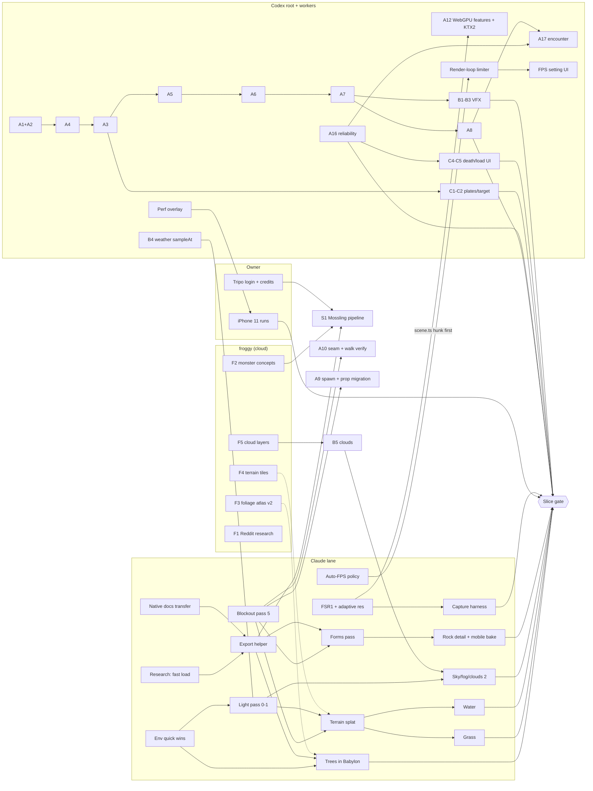

# Program task graph: Sunmeadow slice on desktop and iPhone 11 (2026-10-02)

Owner: Claude, supervisor of the map/visual lane, with planning and verification per the owner's instruction of 2026-10-02.

- **Machine-readable graph:** `docs/plans/2026-10-02-program-task-graph.json`: 52 jobs, no cycles, no unknown dependencies.
- **Harness:** it is proposed as the `.harness/TASK-GRAPH.json` annex. The harness PM is Codex root, which owns `STATE.json` and activates the annex. Claude only proposes it.

> **สรุปภาษาไทย:**
> - **เป้าหมาย:** Sunmeadow เล่นได้จริงและเสถียร
>   - PC (GTX 1050, 60 FPS): ต้องได้ p95 ไม่เกิน 16.7 ms
>   - iPhone 11 (30–60 FPS): ต้องได้ p95 ไม่เกิน 33.3 ms
>   - ทั้งสองเครื่องต้องได้ดีเทลระดับ PC
> - **คนทำงาน 5 ฝ่าย:**
>   - Claude: agent 9 ตัว ทำแผนที่ ภาพ ประสิทธิภาพ และ research
>   - Codex: root, server, VFX, UI ทำ gameplay, server และ UI
>   - froggy: บน cloud ทำ concept art, painted texture และ research Reddit
>   - เจ้าของ: ล็อกอิน Tripo, เทสบน iPhone 11, ส่งงานให้ froggy
> - **งานที่ยาวที่สุด (critical path):** ห่วงโซ่ gameplay ของ Codex 7 ขั้นที่ต้องทำต่อกัน (A1+A2 → A4 → A3 → A5 → A6 → A7 → A8) ผมเสนอให้ server worker ทำ A4/A5/A6 พร้อมกับที่ root ทำ A3 จะช่วยย่นเวลาได้มาก
> - **การตรวจรับ:** Claude ตรวจทุกงานที่ส่งมอบ ทั้งเทสต์ ภาพจากเกมจริงทั้งสอง renderer และตัวเลข p50/p95 ก่อนส่งให้เจ้าของตัดสิน

## 1. Lanes and who does what

| Lane | Members now | Owns |
|---|---|---|
| Claude | Supervisor plus up to 10 agents. 9 are running: FSR1, auto-FPS, environment quick wins, docs corrections, blockout pass 5, and 4 research agents | Map, level design, Blender forms, trees/foliage, lighting/fog/post, map materials, LOD/impostors, `environment.ts`, export helper, capture harness, verification |
| Codex root | root + server + VFX + UI workers (split active 08:36Z) | `main.ts`, protocol/decoders, dynamic monster views, integration, Rust server, VFX files, `ui/**` |
| froggy (cloud) | Tasks F1-F5 in `docs/plans/2026-10-02-froggy-task-pack.md` | Concepts, painted source art, Reddit-first research. No local CPU/GPU cost |
| Owner (human edges) | — | Paste the froggy tasks; Tripo login and credits; iPhone 11 device runs; approvals (CC-BY, status screen); keep/drop calls |

## 2. Graph (summary; the JSON has every job)

## 3. Critical path and how to shorten it

- **Longest chain:** Codex's serial gameplay order, A1+A2 → A4 → A3 → A5 → A6 → A7 → A8 → slice gate (7 steps).
- **Shortening:** A4, A5 and A6 are server-side (`apps/server`); A3 is client views (`main.ts`, decoders). They share no files. The server worker can run A4 → A5 → A6 while root runs A3. The chain becomes about A1+A2 → A3 → A7 → A8.
  - A7 still waits for both, because it migrates the protocol for client and server together.
  - **Agreed by Codex root (08:45Z):** the server worker runs A4 → A5 → A6 while root does A1+A2 and A3. The JSON is updated, and the slice gate's chain drops from 8 to 6 steps.
  - Codex checks the graph against the Harness schema before activating it as an annex.
- **Longest visual chain:** blockout pass 5 → export helper → forms → rock detail, plus terrain → grass/water. The export helper is the shared prerequisite, so Claude starts it as soon as the fast-load and native-docs research land.
- **Human edges block three jobs:** Tripo login (S1 Mossling and hero 02), the froggy pastes (F1-F5), and the iPhone 11 runs. Ask the owner early, in one message.

## 4. Verification protocol

Claude verifies every delivery before it is called done:

1. **Evidence package** per job:
   - a receipt JSON: commands, inputs, outputs and SHA-256, versions, machine state, including whether Blender was running;
   - test counts: `npm test`, `npm run check`, and `cargo test` where relevant;
   - labelled captures: both renderers, day and night, the four locked views;
   - p50/p95 frame time on the GTX 1050 at 1080p, plus the iPhone 11 once the device run exists;
   - budgets: draw calls, triangles, texture MiB.
2. **Claude review** reads the diff of every touched file (`git diff` for tracked files; backups for untracked ones). It re-runs the tests as a smoke check and compares captures against the job's gate and the owning spec. Verdict: VERIFIED / ITERATE (with exact defects) / REJECT. A rejection is reported to the owner the same day.
3. **Native acceptance:** a game capture in Babylon, never a Blender render or a data test alone (team workflow rule 5). The owner keeps or drops.
4. **Codex deliveries:** Claude posts the verdict as a "Verification" note in the Codex inbox and messages root only when action is needed.

## 5. Loop and cadence

- **Agent completions** arrive as notifications. Each one is verified within the same session turn: results, then the next job from the graph.
- **Codex replies:** a monitor watches the root thread's rollout log and emits one line per root reply. It re-arms every 30 min while work is active.
- **Shared resources:**
  - GPU/browser sessions take the lock file;
  - Blender runs one process at a time, with at least 1.5 GB of free RAM;
  - `scene.ts`/`main.ts` allow one writer per hunk. Root holds no `scene.ts` hunk now; A12 waits for the FSR hunk.
- **Owner report:** a short Thai summary after each batch of completions. It covers what landed (with numbers), what was rejected, and what is needed from the owner.
- **Restart window:** the owner can restart Claude (`claude --dangerously-skip-permissions --resume d53323d6-5c9d-470e-9b01-6096e3bd7896`) once no Claude agent is running. The restart also loads the `.claude/agents/*` effort settings.

## 6. Next jobs Claude starts as agents free up (in order)

1. **Export helper:** after the fast-load and native-docs research.
2. **Light pass 0-1:** after the environment quick wins; it lands atomically with B4.
3. **Trees in Babylon:** shared atlas + KTX2, impostor v3, TEXCOORD_1 wind, captures.
4. **Capture harness:** after FSR, which is editing lookdev now.
5. **Terrain splat**, then grass and water.
6. **Forms pass**, then rock detail with the mobile bake.
7. **S1 Mossling:** once F2 and the Tripo login land.

## 7. Roadmap: the next 4 weeks (owner direction, 2026-10-02 evening)

> **สรุปภาษาไทย:**
> - **สัปดาห์ 1:** ทำ Sunmeadow ให้จบ รองรับมือถือ และแม่มดเล่นได้ครบ 6 สกิล
> - **สัปดาห์ 2:** แมพหิมะ Rimecrest กับระบบวาร์ป
> - **สัปดาห์ 3:** hero 01/04/06 จาก Tripo, เมือง r6 และเตรียมรองรับผู้เล่น 500 คน
> - **สัปดาห์ 4:** แมพลาวาและดันเจี้ยนแรก
> - ทุกงานผ่าน gauntlet loop และวัดผลบน iPhone 11

| Week | Claude lane (agents) | Codex lanes (S1-S7 side tasks) | froggy / owner |
|---|---|---|---|
| 1 | Terrain P1→P2; trees in Babylon (shared KTX2, impostor v3, wind); light pass 0-1; capture harness with the reference-match mode; hero 02 witch game-ready; city r6 dressing candidate | S2 boot/memory (A22-A26), S3 mobile (A28 overlay, A29 iOS, R-LOOP), S5 the witch's 6 skills in Look v2, S6 skill bar, S7 Tripo heroes 01/04/06 | F2 monsters and the Mossling 4-view set; F8 Galehorn and Windstone key art; owner: iPhone 11 device run |
| 2 | **Rimecrest** map: layout from the snow pack, blockout, terrain/foliage recipes (snow variants), the Solar Scorpion Stage C loop, the bovine-shaman NPC; the Windstone portal arrival platform | S4 A35 warp network + zone transfer; S5 portal VFX (B14) + weather (snow); S6 warp UI (C9); A31 six-skill data | Rimecrest key art ×3; snow monster 4-view sets; owner: keep/drop |
| 3 | Heroes 01/04/06: Blender cleanup, XS1 rig, clips, LOD + bake, in-game review; city r6 promotion after root's traversal check; Southreach blockout | S1 A32 AOI/delta (protocol v8) + A30 500-bot swarm sweeps; A33 monster parity; city r6 traversal verification | Southreach key art; hero 03/05 regens |
| 4 | Lava region map + its boss; the first dungeon from the roadmap (layout + kit); mobile tier tuning from the device runs | Dungeon transition reuse; navmesh spike (A34); VFX for heroes 01/04/06 skills | Lava + dungeon key art; the next boss concepts |

Every week ends with:
- capture-harness before/after sheets and a perf-ledger line;
- the iPhone 11 overlay numbers once A28 lands;
- a short owner report with keep/drop calls.
