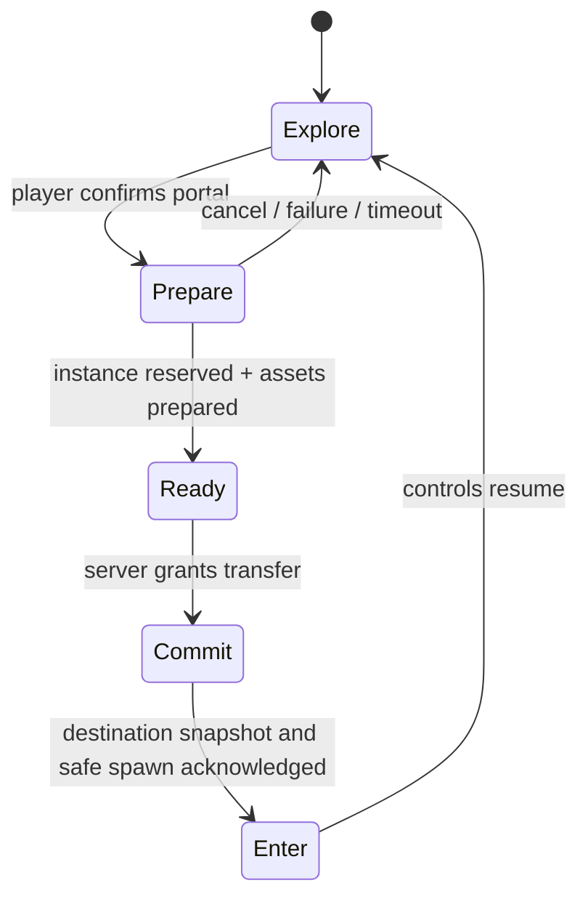

# Region delivery and dungeon transitions

Decision date: 2026-09-30. Finish Sunmeadow first; the lava adventure follows. The user generates new prop candidates from [the prompt pack](asset-prompts/sunmeadow-props-v1.md); candidate selection and engine QA precede admission.

## Recommended player experience

Use a continuous city/field world with streamed art cells. Use separate authoritative instances for dungeons, bosses and party adventures. Preload the likely destination near its entrance. Show a short themed loading screen only while the destination genuinely needs preparation. Do not interrupt walking for every 64 m art-cell boundary.

This is the intended delivery design, not a claim that dungeon instances or cell eviction are implemented. Current Sunmeadow cells load once and remain resident. Current runtime is 50 players/world, 256 live sessions/process, one starter zone and no AOI; the 500-player logical map remains a separately measured milestone.

| Destination | Delivery | What the player sees |
|---|---|---|
| City street / meadow | Nearby art cells and shared materials load before arrival | Exploration continues; lightweight entrance feedback if a cell is not ready |
| Dungeon | Party-specific instance reservation plus a separate zone package | Confirm entrance, short transition/loading panel if needed, then an authoritative safe spawn |
| Boss arena | A bounded encounter instance or an explicitly designed shared-world event | Telegraphs and party state remain readable; the event mode is part of gameplay design |
| Return to field | Recently used field content stays in a bounded cache | Fast return when ready; ordinary load state on a cold cache |

## One transaction, with a recoverable old scene

1. **Prepare:** validate party, destination, prerequisites and current character version on the server. Reserve a bounded instance; identify its zone/content version. Keep the old world recoverable. No reward or inventory mutation follows a loading animation.
2. **Load:** fetch the destination manifest and critical geometry/textures/audio. Validate content identity. Load a staging asset container and share textures/materials through the project resource pool. Compile required visible and instanced shader variants before revealing them.
3. **Ready:** both server reservation and critical rendering resources must be ready. A downloaded GLB alone is insufficient. Require collision/navigation and spawn data to match the zone version.
4. **Commit:** make one authoritative transfer, using an idempotent reservation/transfer identifier. Do not let the same character act simultaneously in old and new rooms.
5. **Enter:** apply the destination snapshot and safe spawn, then reveal the scene and resume controls. Release old room membership. Retain or dispose old resources according to the bounded cache, not a global unload-all operation.
6. **Failure:** return to the recoverable old world or its documented reconnect spawn; dispose uncommitted resources and expire the reservation. Do not award loot twice on retries.

An abort signal can cancel fetches owned by the application. Do not assume every Babylon loader is abortable. Where cancellation cannot stop decoding/import, reject stale completion by transition generation and dispose the late container instead of attaching it to the current scene.

Babylon provides asset containers and scene readiness APIs, which support staging; the transaction, cancellation policy and resource budget belong to this game. See [asset containers](https://doc.babylonjs.com/features/featuresDeepDive/importers/loadingFileTypes) and [scene state transitions](https://doc.babylonjs.com/guidedLearning/createAGame/stateMachine). The project's 9.27.1 API must be used rather than copying mixed-version snippets.

## Loading panel

Use the existing HTML/CSS HUD layer for correctly shaped Thai text, keyboard focus and touch interaction. Use one subdued regional image based on the approved region, a destination title, short gameplay tip, and honest stage feedback:

- `กำลังเชื่อมต่อห้อง` — server reservation.
- `กำลังโหลดทรัพยากร` — measured transfer progress when total bytes are known.
- `กำลังเตรียมภาพและฉาก` — decode, texture readiness and shader work; show an indeterminate stage when progress is not measurable.
- `พร้อมเข้าสู่พื้นที่` — destination state and spawn are ready.

Do not simulate a percentage that reaches 100% while shaders or the server are still waiting. Avoid a full-screen modal for speculative background prefetch. Cancel/retry must be available where safe; a failed reservation should name the actual problem, not leave the player at an endless spinner. Tips must not mask error messages.

For a small warm destination, a brief camera fade is enough. For a cold destination or slow link, keep the loading panel visible and responsive. Do not promise a universal loading duration; measure warm/cold cache and weak-network cases.

## Delivery before expansion

Fresh static inspection on 2026-09-30 confirmed R5 at **67,744,128 bytes, 892,347 triangles, 45 materials and 54 images**. This is file-level evidence, not GPU residency or visible-frame cost. The [receipt](../planning/evidence/city-current-static-inspection-20260930.json) binds its SHA-256.

The existing distant city HLOD stays useful. Replace the all-or-nothing detailed import with district/courtyard packages, shared material families and a dependency manifest. Keep reusable stone, bark, plaster, roof and metal maps outside repeated cell packages where the engine resource pool can reuse them. Nearby cell batches must preserve culling and disposal granularity; one giant world mesh defeats those purposes.

Proposed initial budgets below are authoring targets to calibrate on the reference Android phone, not proven device limits:

| Package | Initial authoring target | Admission evidence |
|---|---:|---|
| 64 m meadow detail cell | ≤40k triangles; ≤2 MiB geometry | Actual export attributes, bounds, hashes and gameplay route |
| Repeated prop | Shared texture palette; 2–3 useful mesh LODs | Player/side/close/elevated silhouette and actual import |
| Hero prop | Extra geometry/material detail only where visible | Compare against the ordinary prop at the same camera and lighting |
| Dungeon critical entry set | Aim at 5–12 MiB compressed transfer | Cold/warm loading, decode/shader readiness, spawn and rollback |
| Low preset whole visible scene | Existing ≤150k triangles, ≤80 draw groups and ≤64 MiB GPU texture target | Real device measurements; per-file counts do not close this gate |

Keep network transfer, decoded CPU data, resident GPU textures, visible triangles and actual passes separate. KTX2 mip sampling reduces distant aliasing; it does not automatically evict unused mip levels. A far impostor can reduce geometry while increasing texture samples, alpha overdraw or shadow cost.

## Sunmeadow as the quality standard

Complete one adventure loop around the existing safe route: arrival/refuge and guide → readable exploration route → monster encounter with attack warnings → optional cart/waystone discovery → authored boss objective → server-awarded reward and return. Preserve existing content IDs where applicable; the boss/refuge additions require data, dialogue and authoritative state, not scenery labels alone.

Lock a freely rotating third-person player camera and camera-relative movement. Validate mobile targeting and attack warnings. A height-changing region requires shared movement/collision/navigation support before art raises walkable surfaces; the current two cells are flat at Y=0.

Define six starting class identities in the gameplay contract, and finish one character pipeline first: final model → rig → locomotion → attack timing → hit reactions → controls → network state. Existing prototype animation is evidence for its present clips, not final character-art acceptance. Any future lava class proposal must reconcile with the Ragnarok-based class roadmap.

Final visual review uses the actual Babylon player camera with the character, a side view, close inspection and elevated views. Blender renders are supporting evidence. The current Tripo oak failed the art review despite valid geometry, LODs and compression; it is available only behind `heroOakPreview=1` in development. See [the review](../planning/evidence/nature-art-review-20260930.json).

## Required transition trials before implementation is called complete

- Warm and cold destination; weak network; shader/texture first-use checks.
- Cancel before commit, server rejection, timeout, stale loader completion and reconnect after commit.
- Party members enter the same instance and do not duplicate membership or rewards.
- Spawn, collision and terrain height agree with the server; return route remains usable.
- Repeated entry/exit does not grow texture/container memory or leave observers, input handlers, audio or actors alive.
- Crowded combat, visible-character budgets and AOI networking are measured independently of empty-map art.

AOI and capacity qualification remain required before increasing the world cap. An instanced dungeon system does not establish 500 players in the same logical outdoor map.
